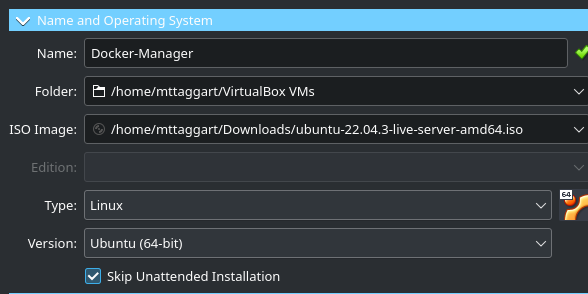

# 2-1: Lab Setup - VirtualBox

This is one of two options for setting up our lab. To use VirtualBox, we'll of course first need it installed. It can be downloaded for all platforms at [https://virtualbox.org](https://virtualbox.org). 

> Note for Apple Silicon macOS users: VirtualBox is available, but you need to visit the [TestBuilds](https://www.virtualbox.org/wiki/Testbuilds) page and download the ARM Beta for macOS. Fair warning though: it is extremely unstable. It would probably be best to use another host for your VMs, or continue with the [Azure Option](./2-2_lab-azure.md).

## Install VirtualBox

The latest version is version 7.0. Make sure you're using that version, or some of these screenshots will look pretty weird.

## Download Ubuntu ISO

We'll be using Ubuntu 22.04 LTS for our base server. Download the installation ISO from the [Ubuntu Download Page](https://ubuntu.com/download/server/). 

## Create the NAT Network

Because we'll be using more than one virtual machine, we need to create a new network in VirtualBox for both of them. Otherwise, VB will annoyingly assign both of them the same IP address! 

In the Tools menu, navigate to the Network section, and choose "Nat Networks." Click "Create."


You can name the network however you like, but make sure that "Enable DHCP" is checked, and click "Apply."


Then return to the "Welcome" section in "Tools."

## Create the Main Ubuntu VM

Let's make our main VM. Click "New."


Let's name the new VM "Docker-Manager," for reasons that will become clear a bit later. But it's descriptive enough for now.

Select the Ubuntu ISO you just downloaded as the ISO Image. And skip the unattended installation. It's actually more trouble than it's worth.



For resources, 2 GB of RAM and 2 CPUs is sufficient. A 30 GB virtual hard disk will do for storage.

Now, before we power this on, we're going to add this VM to our NAT Network. Go to Settings -> Network for your new VM. Switch Adapter 1 to use the ContainerEssentials NAT Network we made earlier. 


Now, power on the VM and walk through the installation steps. Defaults are fine everywhere, except that you _do_ want to install the OpenSSH server. We'll need that for comfortable logging in!


On the screen after the SSH option, you'll be presented with several packages to install, including Docker. **Do not install Docker this way!** This installs an _old_ version of Docker, and we'll be installing it manually.


Complete the installation and reboot the server. Once logged in, take note of the IP address shown by Ubuntu. 


We're going to take that IP, and go back to our NAT Network config. In the "Port Forwarding" tab, we'll add an entry here for SSH, using port 2222 on our host, forwarding to port 22 on the IP address we just saw.


We're not set up to log into the server over SSH, which will be  a much nicer experience than trying to use the VirtualBox console. In a new terminal/PowerShell window, run:

```
ssh -p 2222 user@localhost
```


You should now be logged into your server.

And that's it for our first VM setup!. In the next lesson, we'll install Docker and confirm it's working. 

