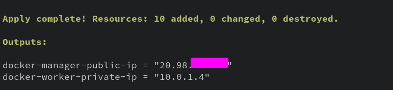

# 2-2: Lab Setup - Azure

This guide is for setting up our lab environment in Microsoft Azure. It presumes that you already have an Azure tenant and a Microsoft account with global administrator privileges. If you don't, you can [sign up](https://azure.microsoft.com/en-us/free/) and get $200 in credit for creating resources, which will be more than enough for what we're doing in this course.

## Terraform Setup

This isn't a course on Azure, even though we're utilizing it for our lab here. Instead of making you learn all the ins and outs, I think it makes sense to use a tool that automates our deployment. That's what [Terraform](https://www.terraform.io) does. Terraform enables the automatic provisioning of cloud resources across multiple providers, using a common syntax.

We need to perform some setup to use Terraform. Let's get started!

### Get the Terraform Plan

I've provided a [Terraform plan](https://github.com/The-Taggart-Institute/container-essentials/blob/main/2-setup/terraform/lab.tf) for your use. If you've cloned the course repo, you already have it. Alternatively, download the file from that link and save it in a new folder.

I'd recommend looking over the file—and, if you're feeling _responsible_, changing the default password. 

### Install the Azure CLI

Terraform can work with many, _many_ cloud providers, but it often requires some help from those providers' first-party tools. Azure is no exception. To easily get our system configured, it's best to download and install the [Azure CLI](https://learn.microsoft.com/en-us/cli/azure/install-azure-cli). 

Once installed on the platform of your choice, be sure to run `az login`, so you have a current CLI session for Terraform to use.

### Install Terraform

Of course, we also need to [install Terraform](https://developer.hashicorp.com/terraform/install?ajs_aid=02b7177c-29f1-4f39-93f1-8d4afffd496c&product_intent=terraform). You can confirm it's installed by running `terraform version`.

## Terraform Deploy

With all our tools set up, navigate a terminal window to the folder in which you saved the Terraform plan (`lab.tf`). Run the following command to initialize Terraform with the required provider data:

```bash
terraform init 
```
If all goes well, we're ready to deploy. Terraform allows us to perform a "preflight" on our deployment to check for errors and show what changes will be made. Run your preflight with:

```bash
terraform plan
```

So what are we making? At base, we'll be deploying two Linux virtual machines: `docker-manager` and `docker-worker`. However, only one of them will be accessible directly. The manager has a public IP address, and we're enabling SSH. But don't worry—we also configure firewall rules so that only your IP address can access the resource. 

When you're ready, run:

```bash
terraform apply
```

And type `yes` to confirm. This will create the 2 VMs in your Azure tenant. 

When all is said an done, you should see some output like:



The first IP is the public IP of the Docker Manager, which you can SSH into from the computer/location you deployed from. Go ahead and log in now with user `ubuntu` and the password from `lab.tf` (you did change it, right??).

Okay, that does it for our Azure setup. Make sure you have both IPs written down, so we can use them in the next lesson to install Docker!

