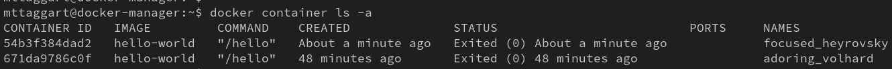

# 3-1: Images

It's time to start doing stuff with Docker. I'm a traditionalist when it comes to new tech, so we'll begin as always with "Hello, World!" In Docker, this means a container that does one thing and one thing only: say "Hello, World!" and prove Docker works.

We've used the terms "image" and "container" a few times now without properly defining them. In the world of containers, an **image** is a snapshot of a filesystem that contains what an application needs to run. A **container** is an image that is actively running. There's a bit more to it that we'll get to, but for now: **containers are running images**. Images are static. They don't change unless we update them. But containers are dynamic, containing any changes from the execution. Additionally, containers are ephemeral. They're meant to be created and destroyed easily, whereas images remain the constant base from which new containers will be run.

Let's see this in action. Start by confirming we have no images downloaded by running:

```bash
docker image ls
```

You should see a blank table.

```
REPOSITORY   TAG       IMAGE ID   CREATED   SIZE
```

Okay, nothing up our sleeves. Let's now attempt to run a container.

```bash
docker container run hello-world
```

Whoah! A whole lot just happened. But helpfully, the thing that happened explained itself! As the container itself reported, first, the "Docker client" (the command-line interface) contacted the "Docker daemon" (the running service that constitutes the "container runtime"), and queried it for the image `hello-world`. 

That's how the `docker container run` command works—it takes an image name to launch as a container.

But we already demonstrated we didn't have any images—locally. So Docker reached out to its **image repository**, known as [Docker Hub](https://hub.docker.com), to look for an image of that name. Once it found it, it downloaded the `latest` version of that image and reported the image's SHA256 hash. 

Then, Docker ran a new container from that image, and displayed its output.

And here we are.

Let's run `docker image ls` again. Hey look at that! An image by the name of `hello-world` has appeared. We now have the image locally, which means the next time we run a container from it, nothing needs to be downloaded.

Try it now. Re-run `docker container run hello-world`.

See? Just the output, no preamble.

## Images -> Containers

So where did those containers get to? Enterprising learners here might have already run `docker container ls` and found nothing.

But here's the thing: `docker container ls` only shows running containers, and our `hello-world` containers have exited. If we want to see exited containers as well, we need to run:

```bash
docker container ls -a
```

A-ha! Here we go:



Here we can see two `Exited` containers, one for each `docker container run` we performed.

Each container has its own ID, like images. They also have a name, the command being run at launch, a created time, and a status. The name might look a little goofy. That's a default name given by Docker, but we can customize that, and many other choices about the container, with command line options. We'll see that shortly.

## A More Useful Image

The `hello-world` image is really just for demo purposes; we can't do anything useful with it. Let's go grab a base image that we _can_ use.

```bash
docker image pull alpine:latest
```

What we've just pulled is an image based on [Alpine Linux](https://www.alpinelinux.org). Its small size and security focus make it an ideal base for many Docker projects. `docker image ls` shows that it's only 7.34 MB! I promise that's much, _much_ smaller than the Ubuntu image.

### Inspecting

So what can we do with this thing? For starters, we can learn more about the image. Let's get a full readout of this thing's details with:

```bash
docker image inspect alpine:latest
```

That's a lotta JSON! At this point, we will want to install a handy tool to parse JSON on the command line: `jq`. 

```bash
sudo apt install -y jq
```

Once installed, send it the output of our Docker command.

```bash
docker inspect alpine:latest | jq
```

We get color, for starters, but that's hardly all. We also get the ability to slice the data for precisely the information we want. `jq` is really a [subject unto itself](https://jqlang.github.io/jq/manual/), but some basic slicing can really come in handy here. Let's learn how the image is configured to launch as a container.

```bash
docker image inspect alpine:latest | jq ' .[] | .ContainerConfig'
```

We should get back a subset of the larger JSON object, including the `Cmd` key, an array of arguments like:

```
[
  "/bin/sh",
  "-c",
  "#(nop) ",
  "CMD [\"/bin/sh\"]"
]
```

The `Cmd` array tells us that by default, Alpine will run `/bin/sh` as its startup command. You can try it now, but there's kind of a catch.

```bash
docker container run alpine:latest
```

The container will run and exit instantaneously. To "capture" and interact with the launched shell before it exits, we'll need to pass some additional command line options to `docker container run`. Specifically, we'll need:

- `-i` for interactivity
- `-t` to create a virtual terminal device (`tty`) to handle the interaction

You may notice that these options directly contradict some of the options we just read from `ContainerConfig`. Good thing we can override them, huh?

## Launching With Options

Let's try one more time, but with options!

```bash
docker container run -it alpine:latest
```

Yes, you can chain option flags like that.

Oh hey, something new happened! Our command prompt changed to a tiny lil `root` prompt! Run `hostname` to demonstrate we're in a new system now! 

We're now in a shell _within_ the container. We can further prove it by running `hostname`, which will show a snippet of the full container ID.

You can also run `ip a s` to see that the container has an IP address within Docker's own network (more on that later), and not the subnet we configured for our virtual machines.

When we run `exit`, the container will stop, and we'll be back in our host's shell. And now, `docker container ls -a` will show the exited container.

## Containers -> Images

Before we move on from images, I want to demonstrate one way to create new images from our containers. Remember that running containers are simply an additional layer of changes on top of the base image. So if we can merge that layer with the base, we'll have ourselves a new image to start from.

Let's start by rerunning Alpine interactively.

```bash
docker container run -it alpine:latest
```

You might have noticed that the shell is `/bin/sh`, not `/bin/bash`. This image does not have Bash installed; that's how barebones it is! But we could make an Alpine image with that simple creature comfort by installing it in our container. 

Alpine uses the `apk` package manager. So to start, let's run `apk` update to refresh the repos.

Then, we can run `apk add bash`. Now we can run bash!

Exit out of `bash` (if you ran it) and `sh`, so we're back to our host.

Another run of `docker container ls -a` shows our just-exited container. But this time, we're going to convert the container to an image with `docker container commit`. This takes the container ID (or name) and the new name/tag of the image. 

Image tags are after the colon in our image names. They allow us to differentiate versions of the same image type. So in our case, we'll use the `bash` tag to differentiate from the normal Alpine image. 

Got that container ID or name? Great. Run:

```bash
docker container commit <container_id> alpine:bash
```

Now, running `docker image ls` will show a new image! We can run bash from this image, with:

```bash
docker container run -it alpine:bash /bin/bash
```

And there we go. We have a functioning bashified Alpine image!

This is not normally how we make new images—for any change more complicated than a simple package add, this process quickly gets onerous. Nevertheless, it demonstrates that images are based on layers of changes, and we can add layers of change introduced in containers.

In fact, images have a handy way to see the layers. Let's run `docker image history` against our new image:

```bash
docker image history alpine:bash
```

What you'll see is a history of changes to the layers that make up the image. You'll see some odd commands like `CMD` and `ADD`. We'll see those again later, but those are specific build instructions used by Docker. Alpine doesn't have a lot of layers, but if you pull a heavier image like `ubuntu`, you'll see quite a few.

## Saving/Loading Images

We've already seen that we can grab images from Docker Hub (and other container registries), but is that the only way? Seems kinda...locked in.

Yeah, no, we don't have to rely on image repos to save and load images. `docker image save` will export a TAR-formatted archive of an image—to `stdout` by default, for some insane reason. So if we wanted to save out our new image, we'd do:

```bash
docker image save alpine:bash > alpine_bash.tar
```

`docker image load` works in the reverse, including the use of `stdin`. So to load our archive as an image, we'd do:

```bash
docker image load < alpline_bash.tar
```

(This avoids `cat` abuse, which we always strive for.)

Up next, we'll dive deeper into running containers.

## Check For Understanding

**Explain the difference between an image and a container. Add a new package to an `alpine:bash` container and create a new image from that container.**
