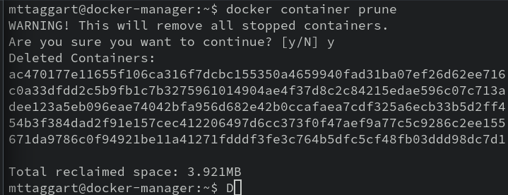
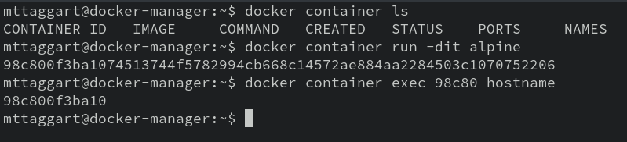
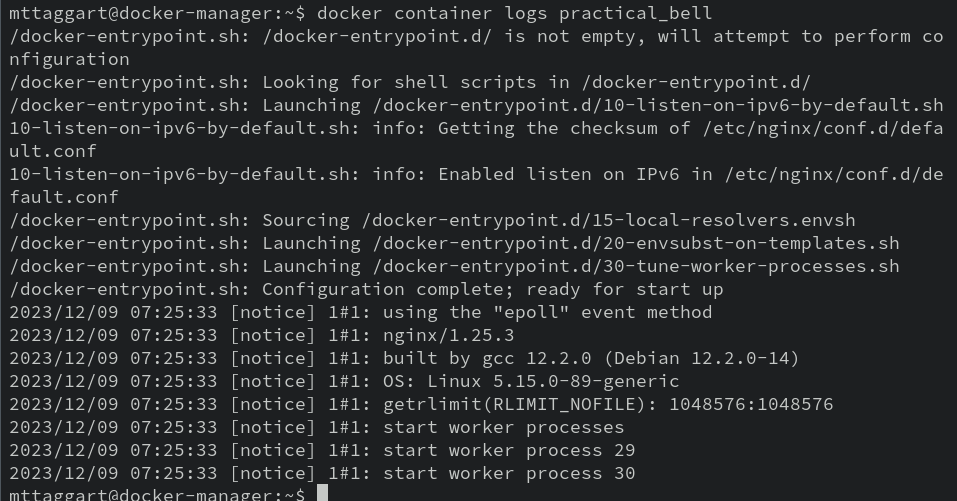
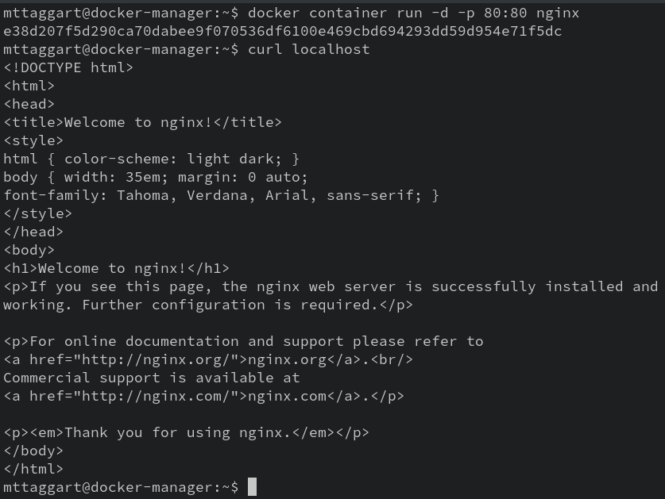
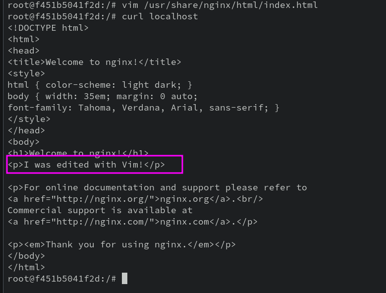
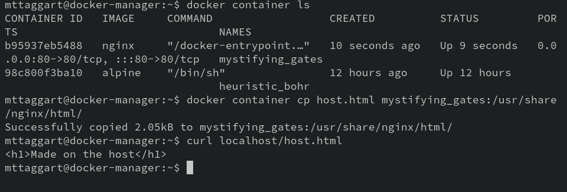
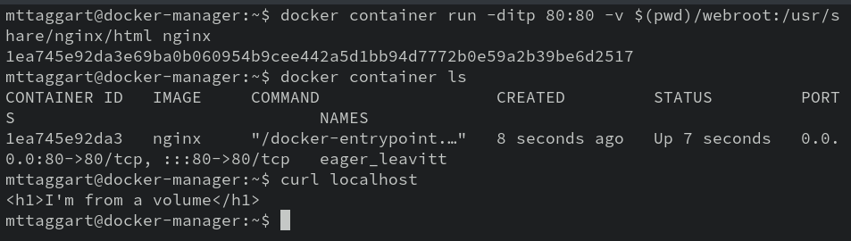

# 3-2: Containers

We've already gotten a start on containers, but there's a lot more to running containers. For starters, we need to do a bit of cleanup. From our early experiments, we have several stopped or exited containers kicking around. While these don't take up  a lot of space, normally (they can though!), they can add up. We can remove old containers with `docker container prune`.



See? Not a lot of space reclaimed, but maintaining a clean working environment is a good habit to get into.

For this lesson, we'll need the `nginx:latest` image. Go ahead and pull it down now.

```bash
docker image pull nginx
```
The Nginx image is a solid starting point for our exploration. It's Debian-based, so we have a familiar package manager available, but also: the way we use the container relies on several common, important techniques.

## Attached/Detached

But before we jump into Nginx, there's more to do with Alpine—I promise, it's related. We've seen that if we run `docker container run -it alpine`, we get a shell, because we've launched the container in **interactive** mode, and allocated a `pty`. But what if we wanted the container to launch, but do so in the background so we could use it later? 

That's possible with the `-d` option, for "detached." Go ahead and try it.

```bash
docker container run -dit alpine
```

> Yes, you can chain option flags. And also yes, we still need the `-i` and `-t` flags.

What you get back, instead of a shell, is the id of the now running container. Check it out with `docker container ls`. Hey look! An Alpine image is running. Notice the `COMMAND` column show `/bin/sh`. 

We launched the container in **detached** mode. We can, as you might imagine, **attach** to the running command.

```bash
docker container attach <container_id or container_name>
```

There's our container shell!. Run `hostname` to confirm you're in the Alpine container. 

Now we run `exit` to leave the container. But wait—`docker container ls` now shows no containers! 

When we ran `exit` on the running command—in this case, the shell we attached to—the container stopped because its running command stopped.

This is hardly ideal. We need a way to execute commands within the container _without_ killing it on exit!

## Exec

There is a way: `docker container exec`. This command will run a separate command from within the container. We can run single commands simply enough. Let's try it with:

```bash
docker container run -dit alpine
docker container exec <alpine_id> hostname
```



> Notice I used just a small snippet of the ID? Yeah you can do that, or the goofy container name Docker creates.

Now if we want a shell, we have to reintroduce `-it` to the mix, because of course this command is interactive and requires a `pty`. Let's try this one.

```bash
docker container exec -it <alpine_id> /bin/sh 
```

And now we have a shell again! But this time, exiting won't kill the container, because this is not the main process! Run `exit` and then `docker container ls` to confirm that the container persists.

Now that we know how to attach, detach, and exec, we can move on to some more interesting containers. Feel free to shut down the Alpine container with `docker container stop <container_id>`.

## Nginx

We downloaded Nginx for a reason. Let's start using this thing!

```bash
docker container run -d nginx
```

Of course we want to run a service like a web server detached. But `docker container ls` tells us that the `COMMAND` for our Nginx container may not be a simple shell. That means there may be useful output getting generated that we can't see. You know, like application logs.

**Spoiler:** there are.

But good news: we can take a peek at that output with `docker container logs <container_id>`.



### Ports

Now, `nginx` is a web server, so ostensibly we would hope this thing is serving some HTTP for us. Let's check.

```bash
curl localhost
```

What gives? Turns out, although we launched `nginx` in detached mode there's more to do in order to expose network services from container to host. It's not so bad though—the syntax is `-p <host port>:<container port>`. Let's run `docker container stop` with the current running container ID, and then we'll try again with `-p`. 

```bash
docker container run -d -p 80:80 nginx
```

Now, when we run `docker container ls`, we see an entry in the `PORTS` column that shows that the host port `80` is forwarded to the guest port `80`.

Let's try `curl localhost` one more time.



There we go. Our webserver is serving some web!

## Adding Content

It's cool that we have a working webserver, but wouldn't it be cooler if we could serve, y'know, actual content? Not just the default Nginx page? How can we do that? 

There are several ways. We'll start with the silliest first: editing files inside the container. 

> Taggart, this is a ridiculous way to deploy web content.

Yes it is! But you'll learn something doing this. Stick with me.

We already know how to `exec` to interact with our containers. Turns out, the `nginx` image has `bash`! Let's get a shell going.

```bash
docker container exec -it <nginx_container> /bin/bash
```

### Echo

First thing we need to know is where Nginx is serving up content from. We could read the documentation on [Docker Hub](https://hub.docker.com/_/nginx), simply `cat` out `/etc/nginx/nginx/conf.d/default.conf` in the container. That tells us the `root` of the site is at `/usr/share/nginx/html`. So that's where we need to put new data.

Let's try it out. 

```bash
echo "<h1>New Page</h1>" > /usr/share/nginx/html/hello.html
```

We don't have to leave the container to test this out. Running `curl localhost/hello.html` should confirm our page is now accessible!

Echoing content into a file is cool, but not for large amounts of data. What if we wanted to use a text editor in the container? If we try to use `nano` or `vim`, we'll find they aren't there. But you know what is?

`apt`.

```bash
# Pick one
apt update && apt install vim nano
```

With our text editor within the container, we can now directly edit or create files. I'm going to edit `index.html`.



Okay, so now we know that we _can_ add missing packages to running containers and make changes directly within them.

But this is a terrible idea, and goes against everything containers are supposed to do for us. Let's see if we can add content without executing command in the container.

### Copy

Another option might be to create our content outside the container, and then move it into the container somehow. `docker container cp` does just that.

Exit out of the container (if you're still in it), and then let's create a new HTML file on our host.

```bash
echo "<h1>Made on the host</h1>" > host.html
```

Now we can use `docker container cp` to move this file into the container. The syntax is a little wonky. It goes: `docker container cp <source> <container>:<destination>`. Here's an example:



> We can use the syntax in reverse to copy data _out_ of containers.

While this is a step in the right direction, we still shouldn't have to modify the container after it's running. We need a way to include our content _when_ the container starts. 

There are two ways to do this: include the content as part of the base image, or mount the necessary data as a **volume** to the container. 

We'll explore creating our own images in the next lesson. For now, let's check out volumes.

### Volumes

Docker volumes are in fact a pretty deep concept, and we're only scratching the surface in this lesson. Still, they're pretty handy! We can use `-v` to mount an **absolute path** on the host to a location in the container.

So for our web content, let's make a new folder on our server.

```bash
mkdir webroot
```

And let's put a file with some HTML in there.

```bash
echo "<h1>I'm from a volume</h1>" > webroot/index.html
```

Now we can mount this directory as a volume in a new `nginx` container. Oh, you should `docker stop <nginx_container>` first. This is where we put all the command line options together, so it's going to look a little wacky.

```bash
docker container run -ditp 80:80 -v $(pwd)/webroot:/usr/share/nginx/html nginx 
```

The result should be something like:



We've successfully overwritten the existing path in the container with our volume. This attachment of a host directory to the container is known as a **bind mount**.

As I said, there's a lot more to volumes, but we've finally arrived at a method for attaching content to a container that doesn't require us to modify a container that's already running. 

Why does this matter? Remember that containers are intended to be _ephemeral_. We should be able to blow them away and bring up new versions without any harm to the data we care about. That means our persistent data has to exist separately from the container, as in our volume example. And we don't want to perform any manual steps post-provisioning on the container, which is why the `docker container cp` approach is not so great.

But congratulations; you've deployed your first containerized web application! It might be crazy simple, but the deployment principles will remain similar, regardless of of the complexity of the application logic. That's the beauty of infrastructure-as-code.


That's right—you're DevOpsing now.

Soon, we'll be making our own images with the resources we need inside. But before we get there, let's build on our knowledge of running containers to take advantage of some complex tools that can be difficult to install otherwise.


## Check For Understanding

1. **What is "detached mode"? When do we want to use it when starting a container? What is the command line option flag to do so?**

2. **Deploy a second Nginx container running on port 8080. Modify what it serves as its default page using a bind mount.**
