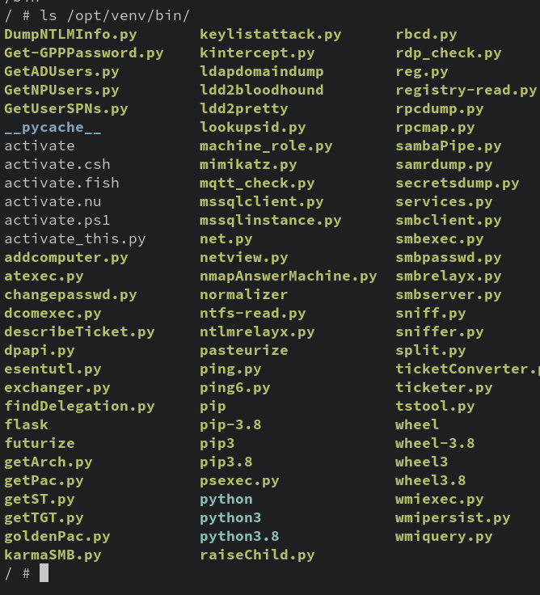

# 3-3: Running Tools in Containers

We have more to learn about making images, but first, let's apply what we already know to make our lives a little easier. Very often, we'll want to run a tool that has complex dependencies. Or maybe, the dependencies are so old, it would be complicated to install them on our system (looking at you, Python 2). 

Docker can really help in these situations. In this lesson, we're going to go through two examples of how to use Docker to avoid installation complexity.

## Example 1: Python 2

Python 2 has been deprecated for a while now—[nearly three years](https://www.python.org/doc/sunset-python-2/), as of this writing. And yet, it is common to find tools that remain in Python 2, having never been updated. [The Exploit Database](https://exploit-db.com) is a prime example. Countless proofs of concept that were written once and never given a second thought now molder in unsupported syntax. And while `2to3` exists, it's hardly perfect. It would be easier to just run the old code with Python 2, but installing Python 2 on a system is increasingly difficult.

Instead, it would be rad if we could use Python 2 for a hot minute when we need it, then do away with it when we're finished.

With Docker, we can!

The Python Foundation maintains an [official Docker image](https://hub.docker.com/_/python), with tags for multiple version of the language available. A search for `2.7` amongst the tags reveals that yes, there are still old versions of Python available. 

So to start, let's pull `2.7.18`.

```bash
docker image pull python:2.7.18
```

> You might notice during this `pull` that the image has a lot of layers! You should check them out either on the Docker Hub page, or using `docker image history`. Another opportunity to see how images are built from layers of change!

Now, let's make a quick Python 2 script. Let's keep it simple. Save this (or something like it) to `2script.py`.

```python
# The old print syntax is the easier distinguisher
print "I'm from Python 2!"
```

Think first, about how you'd use Docker to get this script to Python 2. 

--- 

Got it?

Hopefully you arrived at using volumes to get the script directly into the container!

We know now how to mount host locations in the container. Let's use that to run a Python 2 script that's been mounted inside the container.

```bash
docker container run -v $(pwd):/scripts python:2.7.18 python2 /scripts/2script.py
```

You should see your script output! And there we go-we just used Docker to run Python 2 code without having to mess up our host system!

## Example 2: Rust

In security, it's common to need to use a tool that's been written in an unfamiliar programming language. And as some kind of gatekeeping technique (or just laziness?), tool developers will only provide source instead of compiled binaries. And while we could install the entire toolchain on our system, with Docker, we don't have to.

Let's start by cloning down a Rust-based tool. Let's try, I dunno, [PwFuzz-RS](https://github.com/mttaggart/pwfuzz-rs), a password list mutator by yours truly. 

```bash
git clone https://github.com/mttaggart/pwfuzz-rs
```

And now, let's pull the Rust Docker image.

```bash
docker image pull rust
```

We have our pieces; now we need to put them together. We know how to mount volumes to specific locations inside the container. We'll mount the `pwfuzz-rs` folder to the location `/pwfuzz-rs` in the container. Remember that volume mounts in Docker need absolute paths, so that will be like `$(pwd)/pwfuzz-rs:/pwfuzz-rs`.

To compile the project, we would use the command `cargo build --release`, so that'll be the final part of our command. But to make our lives a little easier, we're going to add two additional command line options. 

First, `-w` sets the working directory for the container—in our case, `/pwfuzz-rs`. This makes the `cargo` invocation actually work, because it'll be looking for specific files in the directory from which it's run.

Second, `-u` runs the container as a different user. By default, Docker containers run as `root`, but that would mean our host user wouldn't own the compiled targets! The user is passed as a `user:group`, which we can do in a bash one-liner with `$(id -u):$(id -g)`.

Assembling all of these options, we get one hilariously long Docker one-liner:

```bash
docker container run -v $(pwd)/pwfuzz-rs:/pwfuzz-rs -u $(id -u):$(id -g) -w /pwfuzz-rs rust cargo build --release
```

This might take a minute to run, but look at it go! Rust is compiling `pwfuzz-rs` from source. When all is said and done, you'll find a new folder in `pwfuzz-rs`. The `target` directory contains compile targets, and inside of _that_ folder, you'll find `release`, which contains our compiled binary! YOu can run `pwfuzz-rs/target/release/pwfuzz-rs -h` from our top level to confirm it's been compiled and works.

This might seem trivial, but consider that we were able to compile a tool without dirtying our host at _all_. We used Rust as necessary, then removed it when finished. Pretty powerful, if you ask me!

## Example 3: Impacket

For our last tool example, we're going to start transitioning away from crazy long command-line options. Instead, we're going to use a specification file to **build** a Docker image that's useable. In the next chapter, we'll learn how to make these spec files ourselves, but for now, we can take advantage of the many, many projects that deploy code this way.

This spec is known as a **Dockerfile**. It contains instructions for how to build a new image from scratch. Think of it as a programmatic way of doing much of what we've done already, executing commands in containers, copying data inside, and then using `docker container commit` to produce a new image.

If all that felt like a lot of effort to build a new image, well, it is! And that's why Dockerfiles exist. For this one, let's download the [Impacket repo](https://github.com/fortra/impacket) to our server. 

Now let's move into that folder and look around.

```bash
cd impacket
ls
```

We see there's a `Dockerfile` in there. Let's `cat that thing out.`

```Dockerfile
FROM python:3.8-alpine as compile
WORKDIR /opt
RUN apk add --no-cache git gcc musl-dev python3-dev libffi-dev openssl-dev cargo
RUN python3 -m pip install virtualenv
RUN virtualenv -p python venv
ENV PATH="/opt/venv/bin:$PATH"
RUN git clone --depth 1 https://github.com/fortra/impacket.git
RUN python3 -m pip install impacket/

FROM python:3.8-alpine
COPY --from=compile /opt/venv /opt/venv
ENV PATH="/opt/venv/bin:$PATH"
ENTRYPOINT ["/bin/sh"]
```

**You don't need to understand this file right now!** We'll be going over how Dockerfiles work in the next chapter. But even now, I bet you can get a sense of how the image is built. Each line is a layer of change, up to the `ENTRYPOINT`, which defines what will run when we start the container.

### Building the Image

Now, let's use it to build an image. The core command will be `docker image build,` but of course there are some options to pass.

For one thing, `docker image build` needs a build **context**—basically, where to build from. Usually we run this in the folder with the `Dockerfile`, so that would just be `.`. 

For another, we need to name this thing! We do that with the `-t` option, for "tag." So if wanted a tag other than `latest`, we'd do `name:tag`.

All together now, still in the Impacket folder:

```bash
docker image build -t impacket .
```

Down come the dependent layers, after which Docker begins executing the instructions in the Dockerfile, creating our new image layer by layer.

Once all is said at done, `docker image ls` reveals we have a new `impacket` image! Not too terrible as a process, mm?

But how to use it?

### Running the Container

Let's start by running a new container from this image.

```bash
docker container run -it impacket
```

We are immediately kicked into a root shell. Nothing looks particularly interesting...until we examine the `$PATH` environment variable.

```bash
echo $PATH
```

Huh, weird, wonder what's in that `/opt/venv/bin` directory?



Oh. All the tools. Neat.

### Using the Tools

This part is gonna be fun, but take it step-by step.

We're going to use Docker to run 2 different Impacket tools in two different containers: one will be a SMB server using `smbserver.py`, and another will use `smbclient.py` to connect to the first server. One image, two sides of the conversation. 

Let's set up the SMB Server. We need something to server, for starters. Create a new folder—call it whatever you want.

```bash
mkdir stuff
```

And let's toss some data into that directory. You can use your imagination.

```bash
echo "Hello from the SMB Server!" > stuff/hello.txt
```

We'll be mounting that directory as a volume inside our server container. We'll also, for convenience, be forwarding port 445 into the container. 

We saw that the Impacket container's **entrypoint** was `/bin/sh`, so that means we'll want to launch it in interactive mode, with a tty. And we'll actually launch the server separately, after the container is up.

And here's a new trick! Instead of relying on Docker's name for the container, we're going to explicitly name it with the `--name` option.

All together now:

```bash
docker container run \
-ditp 445:445 \
-v $(pwd)/stuff:/stuff \
--name smb_server \
impacket
```

`docker container ls` will show we have a running container with port 445 forwarded, and the appropriate name.

Now we need to start the SMB server in there. This we'll do with a quick `docker container exec` invocation.

```bash
docker container exec -dit smb_server smbserver.py stuff /stuff 
```

Let's break that down. We're running interactively with a terminal (`-it`) because this command generates output. But we don't need to attach to it, so we run it detached (`-d`). The server script is `smbserver.py`, which is available on our container's `$PATH`.

The syntax for `smbserver.py` takes, at minimum, a share name and a location. Our location will be `/stuff`, and so our share name can also be, creatively, `stuff`. So all together:

```bash
docker container exec -dit smb_server smbserver.py stuff /stuff
```

It's a blind command, but this kicks off the SMB server with our data. Now, we get to access it with `smbclient.py`.

For this one, we're going to run a _second_ Impacket container. This one we'll interact with directly, so just `-it`, no `-d`. We also don't need to forward any ports or mount any volumes. Honestly, pretty easy!

So let's complicate it a little bit. Because this container is intended to be ephemeral, we don't need it to stick around as a stopped container after we exit. So we'll pass the `--rm` option to delete it immediately after we're finished.

```bash
docker container run -it --rm impacket
```

we're once again at a humble `sh` prompt. Here, we're going to kick off `smbclient.py`. The syntax for use in our case is simple: `smbclient.py <target_ip>`. No username or anything needed for this server.

In my case, and maybe yours, that'll be:

```bash
smbclient.py 10.0.2.4
```

> This is why we forwarded port 445 from the host: to make this part easier!

If all goes according to plan, we'll be connected to our SMB server. Run `shares` to see the available shares. 

If you see `STUFF`, then `use STUFF` to access that share. Then, just like a normal directory, you can `ls`. `hello.txt` should be there. Running `get hello.txt` will download it to the container's filesystem. `exit` out of the SMB client to return to the container shell. 

Finally, `cat hello.txt` will reveal the server message.

And that's it! We've successfully used two Impacket tools together, across two separate containers. 

Go ahead and exit out of the client container, and use `docker container stop smb_server` to kill the server. You can then use `docker container prune` to clean up.

Phew! That was a lot, but now you have a handle on how to use Docker to quickly access tools that are otherwise tough to install.

## Check For Understanding

1. **What are the advantages and disadvantages to using containers to run certain tools?**

2. **Find another tool install and run using Docker!**

