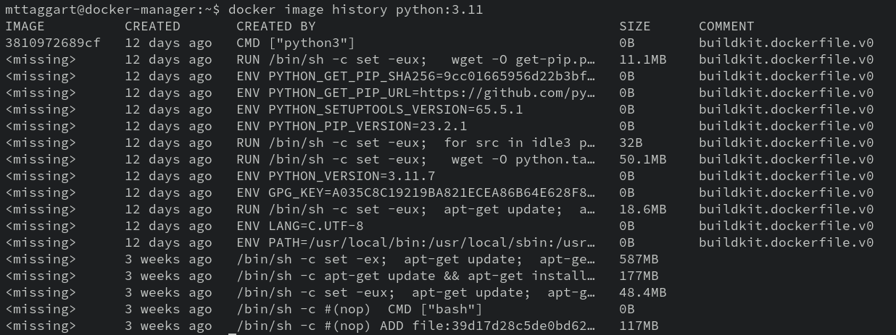
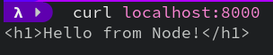

# 4-1: Dockerfiles

In the last chapter, we used a Dockerfile to build an image for Impacket tools. That was cool, but wouldn't it be _even cooler_ if we could write our own Dockerfiles to make our images?

That's what we're doing now.

## Read the Docs!

I'm going to tell you up front that we will _not_ be covering every single instruction you can use in a Dockerfile. I strongly recommend you review the [Dockerfile reference](https://docs.docker.com/engine/reference/builder/) and keep it handy as you go through this chapter—and anytime you're creating a Dockerfile, really.

## What Is a Dockerfile?

From one point of view, a Dockerfile is a program. It's a set of instructions to Docker that tells it how to build an image. Simple enough, right?

Let's complicate it.

From _another_ point of view, a Dockerfile is a list of changes, which become layers atop the base image. A really cool way to see this is `docker image history`. Check out the history for one of our Python images. 



What you're seeing, in reverse chronological order, is every instruction that went into the Dockerfile to make the image. That's why the "first" one is the `CMD` instruction, which determines the default command to execute when the image is run as a container.

## Writing the Dockerfile

But we're getting ahead of ourselves. We're going to make a new image from a Dockerfile, so let's get get up. Start by making a new folder called `mynodeapp`, and moving into it.

```bash
mkdir mynodeapp
cd mynodeapp
```

As the name might suggest, we're going to be making a tiny [NodeJS](https://nodejs.org) application. But don't worry, you don't need to know _any_ JavaScript to make this happen. That part we'll handle for you. Download [mynodeapp.zip](./mynodeapp.zip) and extract its contents to your `mynodeapp` folder. You should now have a `src` folder that contains all the application code you'll need. No fuss, no muss.

Using any text editor you like, create a new file called, originally, `Dockerfile`. It's actually a "magic name" that Docker expects for certain operations. 

### `FROM`

The first line of our Dockerfile is the `FROM` command. This defines the base image on which we'll build. So yeah, it's not _entirely_ from scratch, but base images are reasonable starting points.

The [Node Image Page](https://hub.docker.com/_/node/tags) shows a ton of tags to choose from. I like to use the latest version with an Alpine flavor. As of this writing, that means the `20-alpine` tag. So our instruction is:

```docker
FROM node:20-alpine
```

Don't worry that we haven't pulled the image yet; Docker knows what it needs to do during build. We'll get there.

### `COPY`

At this point, we have a base image with NodeJS installed, but it doesn't yet have our source code. We need a way of loading it into the container.

> "Don't you mean 'load it into the _image_?'"
> 
> Yes, but no. Remember that the build process creates a series of containers, the last of which is saved as an image.

The [`COPY`](https://docs.docker.com/engine/reference/builder/#copy) instruction works exactly as you think: `COPY <src> <dest>`. We can use relative paths, and we can create new directories with `dest`. Let's make a directory called '/app' in the container, which will represent what's in the `src`. 

```docker
COPY ./src /app
```

### `WORKDIR`

With our code copied over to the container, it would be nice if we could `cd` to the new directory, so subsequent commands don't all need `/app`. We can do just that with `WORKDIR`. All future instructions will execute from that context.

```docker
WORKDIR /app
```

### `RUN`

Node apps usually have dependencies as defined in `package.json`. Ours has one dependency, but it's critical. We can install it using `npm`, the Node Package Manager. It's available in the container; we just need to invoke it. The `RUN` instruction runs shell commands in the build container. We'll run `npm i`, short for `npm install`.

```docker
RUN npm i
```

### `ENV`

Our Node application operates as an ad-hoc web server, which means it needs receive requests on a TCP port. We've seen how to forward ports to containers with `docker container run -p`. But which port to forward? A glance at our source code would inform image builders that the default listening port is 8000, but the code also watches for the `NODE_ENV` environment variable and uses that value instead if set. 

We can use the `ENV` instruction to set default environment variable values. **Do not use this for secrets!** It's common for secrets to end up as environment variables when working with containers, but this is _not_ the way to get them there. We'll discuss secrets management in a later chapter.

`ENV` uses a `key=value` syntax.

```docker
ENV NODE_PORT=8000
```

> If you really want to test this, make it a different number than the default. Remember that later when we run the container!

### `EXPOSE `

 We've established our app's source code can tell us what ports are being used, but we shouldn't require builders to review source for that information. That's what `EXPOSE` is for. it doesn't actually forward any ports—rather, it's a kind of annotation embedded in the image's history that can inform container users what ports they'll need to forward.

```docker
EXPOSE 8000
```

### `ENTRYPOINT`

Last instruction! We want our app to launch automatically when the container uns. That's what `ENTRYPOINT` is for. It tells Docker how to start the container. 

Now there is also the `CMD` instruction, which would appear to do the same thing. What's the difference? `ENTRYPOINT` gives us a little more flexibility, because we can use it _in conjunction_ with `CMD` to provide additional arguments. Also, interestingly, when a user explicitly adds a command to `docker container run`, it is overriding anything in `CMD`, but _not_ `ENTRYPOINT`. That means we can have a base `ENTRYPOINT` and add more arguments at runtime.

**TL;DR**, use `ENTRYPOINT` if you intend for the same command to run every time the container launches.

```docker
ENTRYPOINT node ./
```

> Remember we set `WORKDIR` to `/app`, so the `./` in that command refers to the current directory. Node then searches for `index.js` in that location and executes it.

### Full Dockerfile

So, all together, we've written:

```docker
FROM node:20-alpine
COPY ./src /app
WORKDIR /app
RUN npm i
ENV NODE_PORT=8000
EXPOSE 8000
ENTRYPOINT node ./
```

This is our complete Dockerfile! Of course, this is by no means the entirety of what we can do with Dockerfile instructions. For example, `ADD` has some powers `COPY` does not, such as fetching material from remote Git repos.

I'll again encourage you to refer to the [Dockerfile reference](https://docs.docker.com/engine/reference/builder/#a).

## Building the image

Time to build! We've already seen how `docker image build` works. Let's use the image name `mynodeapp`.

```bash
docker image built -t mynodeapp .
```

Our image should now be available and visible in `docker image ls`.

## Running the Container

At long last, we can run our app container! **Please run it detached, or your shell may be forfeit!**

```bash
docker container run --rm -ditp 8000:8000 mynodeapp:latest
```

If all has gone according to plan, we should be able to `curl localhost:8000` from our host and receive data from our app!



We can also run `docker container logs` against the running container to see the `Listening on $PORT` message, confirming the app works.

### Modifying `NODE_PORT`

Before we end, I want to touch on modifying environment variables. Although we defined `NODE_PORT` in the Dockerfile, environment variables can be overridden with the `-e` option flag. So if we run:

```bash
docker container run --rm -e NODE_PORT=8001 -ditp 8001:8001 mynodeapp:latest
```

We will now be able to `curl localhost:8001`, and `docker container logs` for our new container will show `Listening on 8001`. The app still works, but on a port of our choosing!

Congratulations on creating your first Docker image! Now that we know how to make them, we need to learn how to publish them. That's up next.

