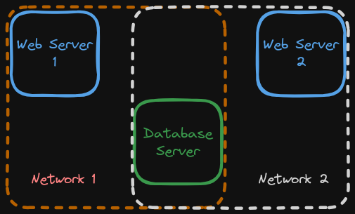

# 4-4: Networks

When Docker is first installed on a system, the network configuration changes in a way that's surprising the first time you see it. Run `ip a s` on your Docker host.

Amongst the network interfaces, you'll notice `docker0`. It has an IP address of `172.17.0.1/16`. What's going on here? Let's try running a container to see what's going on. 

```bash
docker container run -dit --rm alpine:latest
```

Now that it's running in the background, let's inspect it using our `jq` tool again.

```bash
docker container inspect <container> | jq '.[] | .NetworkSettings.Networks'
```

> You can of course just run `docker container inspect <container>`, but this cuts to the heart of the matter.

We see a `bridge` network configuration here, with a gateway and IP address in the `172.17.0.0/16` subnet. Sound familiar?

When we stand up a container, by default it is joined via a network bridge to the `docker0` interface, and given an IP on that subnet. The gateway, as you see, is that `docker0` interface, meaning our host serves as the router (and DNS server, by default) for all Docker containers we start.

## Creating Networks

But we don't have to live with defaults. Let's create a new network and—just for funsies—let's make it use a different address space.

```bash
docker network create --subnet 10.10.99.0/24 mynet
```

`docker network ls` will now show us our new network. Note that the driver defaulted to `bridge`, which is what we wanted.

Now, let's start a container that's attached to our custom network. We do so by passing the `--network ` command line option.

```bash
docker container run -dit --rm --network mynet ubuntu:latest
```

Now when we re-run the `docker container inspect` command above to see the `NetworkSettings,` we can see that the Gateway and IP Address are in the subnet we defined for `mynet`!

Go ahead and bring down that container.

## Why Use Multiple Networks?

It seems silly to go to all this trouble. Why bother? Imagine I had a web application made of two services—a web server and a database server. Now, these would be able to communicate with each other on the default bridge network anyhow, but now imagine that I had _another_ application that, for whatever reason, I wanted to share the same database. I need the second app's web server container to communicate with the original database server, but maybe I don't want to allow that web server to access _everything else_ on the default bridge network. 

A diagram may help.



Now, I've isolated the web servers from one another. Is it perfect? Certainly not, but I've reduced the attack surface of each individual network, and may add additional defenses to the database server, the single pivot point.

## Multiple Networks Demo

Let's create two more networks: `net-1` and `net-2` for our purposes.

```bash
docker network create net-1
docker network create net-2
```

And now, let's create some containers—one on each network, to start.

```bash
docker container run -dit --name ubuntu-1 --network net-1 ubuntu
docker container run -dit --name ubuntu-2 --network net-2 ubuntu
docker container run -dit --name ubuntu-3 --network net-1 ubuntu
```

So we've created three containers. The first two are attached to their respective networks. The third, for now, is attached to `net-1`, but that's honestly just a matter of sequencing. The idea is to connect `ubuntu-3` to _both_ network. We can do this with `docker network connect`.

```bash
docker network connect net-2 ubuntu-3
```

Now, `docker container inspect ubuntu-3 | jq '.[] | .NetworkSettings.Networks'` will show us two networks for the container. Also notice that Docker intelligently changed the subnets for each, despite us not providing that configuration.

## Hostname Resolution

Let's start a shell in `ubuntu-3` to play with our networks.

```bash
docker container exec -it ubuntu-3 /bin/bash
```

In theory, this machine is connected to both networks we created and should be able to contact both `ubuntu-1` and `ubuntu-2`. You might think we should have gone to get the IP addresses of both of those before jumping into this shell. I mean, we could reasonably guess that the addresses are `172.19.0.2` and `172.20.0.2`, respectively, but here's the thing.

_We don't have to_. Docker has yet another networking trick up its sleeve: it performs transparent hostname resolution for containers.

Let's install `ping` to get started. Yes, these containers are even missing `ping`.

```bash
apt update && apt install -y iputils-ping
```

Now, we can successfully run:

```bash
ping -c 4 ubuntu-1
ping -c 4 ubuntu-2
```

How about that? The hostnames resolved! This feature becomes critical in heavily interrelated multi-container applications. Think about it: we won't necessarily know any IPs that services might have to connect to, but we can control hostnames. 

Imagine a WordPress application done in Docker. You might have one container for the PHP code/webserver, and a second for the database. The database config then could use a container name as its hostname rather than a clunky IP address.

This is not theoretical; we're going there next. Let's stop all our containers and remove all our networks. Here's a quick way to stop all running containers:

```bash
docker container ls | cut -d " " -f 1 | tail -n+2 | xargs docker container stop
```

Then you can clean up stopped containers and networks with their respective `prune` commands.

And now, we're ready to explore how we _really_ build multi-container applications: Docker Compose!

## Check For Understanding

1. **Create a new network using a custom subnet. Attach an existing container to this network.**


