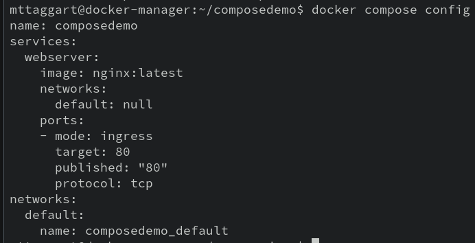

# 4-5: Docker Compose

If all this manual typing of `docker` commands to create containers, volumes, and networks piece-by-piece feels a little laborious and not very "DevOps," well, you're right.

In most actual usage, Docker is not used in this way. It's invaluable for learning the concepts around containers, but to build reproducible containerized applications, we make use of one command above all: `docker compose`.

## How Compose Works

Docker Compose (which used to be a separate `docker-compose` add-on script), is used with YAML files that contain a specification for an entire application. Every container, volume, and network is defined in a single file. We can then run `docker compose up` (and a few option flags, of course) to bring up all the necessary resources for our multi-container application.

### A Simple Compose File

Let's create a new folder called `composedemo` to store our work. Then, with any editor you like, create a new file called `docker-compose.yml` inside this new folder. The contents should look like this:

```yaml
version: "3.8"
services:
  webserver:
    image: nginx:latest
    ports:
      - 80:80
```

Here we're defining a single "service," made of an Nginx container that forwards port 80.

We can confirm that the spec is written correctly by running `docker compose config` in our `composedemo` directory.



What da—how did it know what to look for!?

Docker looks for files called `docker-compose.yml` by default, but you can also pass `-f` with a filename to change that default. Also notice that the `name` was filled in with the name of the containing directory. This can be customized by passing the `-p` option, for "project name."

If there had been an error in our syntax, `docker compose config` would have reported it. But since it reported the fully fleshed-out spec instead, we know our file is good to go. It's always a good idea to run `config` after writing a compose file.

Let's launch this thing. We can do so with:

```bash
docker compose up -d
```

The `-d` is for "detached," making sure we don't lose our terminal entirely to the container.


We get a fun little animation and then, 2 items are created: a network and a container. The container was expected, but the network may be a bit of a surprise. The network isn't super helpful for single-container applications, but compose files can contain multiple services. At that point, making an ad-hoc network makes some more sense.

`docker container ls` confirms that we have a running container with port 80 forwarded. It also has a name like `composedemo-webserver-1`, meaning we have a predictable container name.

We can stop our application by running `docker compose stop`. This stops any running containers, but doesn't remove them. And then of course, `docker compose start` will bring our services back up.

To fully destroy our application, we use `docker compose down`.

Just to reiterate, all these commands should be executed within the folder containing the specific `docker-compose.yml` file related to the app you want to affect.

## Building Toward Reality

Obviously we're not about to deploy Nginx without any actual content served up. So how can we include content in a container using a compose file?

Easy mode is an ad-hoc **bind mount**, which is similar to using `-v` with a filesystem directory, as opposed to a defined Docker volume.


```yaml
version: "3.8"
services:
  webserver:
    image: nginx:latest
    ports:
      - 80:80
    volumes:
      - ./html:/usr/share/nginx/html
```

We've added a `volumes` key to our `webserver` service. The syntax for each array element underneath `volumes` can match what we've used on the command line, although it can actually use relative paths. There is also a [long-form syntax](https://docs.docker.com/compose/compose-file/compose-file-v3/#volumes) that's worth learning as well, because it can be clearer when setting multiple mount options.

To make this work, let's add a `html` folder inside of `composedemo` and add a little web content.

```bash
mkdir html
echo '<h1>Hello from Compose!</h1>' > html/index.html
```

When we run `docker compose up -d`, our content will be mounted to the default webroot for Nginx. We can test this with `curl localhost`.

Go ahead and bring the service down again with `docker compose down`. As we mentioned before, this kind of volume mounting isn't always the best choice. Instead, we could consider including the code in a new Docker image.

> "But then you'd need to pull the image before you use the compose file!"

Not if we _built the image in-place_. We can provide a `build` key in our compose file that determines how we build the image that we use for the base of our containers. Of course, we will still require a Dockerfile, but we know how to do that now.

Let's create a new Dockerfile in `composedemo`. Something a little like:

```docker
FROM nginx:latest

COPY ./html /usr/share/nginx/html
```

And let's modify our `docker-compose.yml` so that our `image` is custom, and we include the `build` context of our local directory. And since we're copying the code directly to the image, we do away with the volume entirely.

```yaml
version: "3.8"
services:
  webserver:
    image: composedemo:latest
    build: ./
    ports:
      - 80:80
```

A new run of `docker compose up` will build the image, sure, but if you want to do that as a separate step, `docker compose build` will build all the required images for the application.

Then, `docker compose up` will bring up our application, with custom-built image.

Now that we have the basics down, let's start to build a more realistic application. How about a WordPress blog that runs in containers? 

## Check For Understanding

1. **Why is a Compose file preferable to a one-liner `docker` command? Think about the entire product lifecycle.**

2. **While referencing the Compose file specification, create a new application that uses a custom network.**
