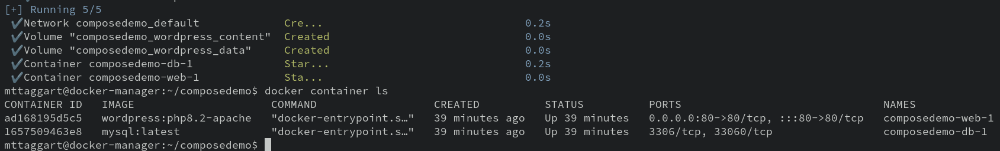

# 4-6: WordPress via Docker Compose

Creating a WordPress blog in containers has a lot to recommend it: easy updates of code, isolation of dependencies, and some light sandboxing of an app this is, shall we say, "renowned" for its appeal with criminals for exploitation. All while persisting the blog's data in external, managed volumes.

What would comprise a Dockerized WordPress app? We'd need:

- PHP-enabled webserver 
- WordPress code 
- Database server

That seems like 3 containers, but in reality, the WordPress code and webserver are the same thing, so this is a simple 2-container application. Both [WordPress](https://hub.docker.com/_/wordpress) and [MySQL](https://hub.docker.com/_/mysql) have Docker images ready to go. I encourage you to review the various tags for each, as well as the intro documentation on their pages.

## Services

The WordPress image has several variations. To keep things simple, we'll use the `apache` variant with the latest PHP version. As of this writing, that would be `php8.2-apache`.

```yaml
version: "3.8"
services: 
  web:
    image: wordpress:php8.2-apache
```

For MySQL, we can just use the `latest` tag. We'll call that the `db` service.

```yaml
version: "3.8"
services: 
  web:
    image: wordpress:php8.2-apache
  db:
    image: mysql:latest
```

## Environment Variables

A quick glance at the main pages for either image will tell you that defining the images isn't going to be sufficient. Each of them relies on specific environment variables to function.

We briefly touched on environment variables while exploring Dockerfiles. The concept is similar here, except that we have two options to define them: as list with `=`, or proper key-value pairs.

```yaml
environment:
  - FOO=bar

# or 
environment:
  FOO: bar
```

Either works, but I prefer to use YAML as it's intended wherever possible.

For WordPress, we at least need the following variables set:

* `WORDPRESS_DB_HOST`
* `WORDPRESS_DB_USER`
* `WORDPRESS_DB_PASSWORD`
* `WORDPRESS_DB_NAME`

For MySQL, a complementary set is required:

* `MYSQL_ROOT_PASSWORD`
* `MYSQL_DATABASE`
* `MYSQL_USER`
* `MYSQL_PASSWORD`

We'll define these in each service's respective `environment` object.

> **NOTE:** What we're about to do is _not_ a security best practice. I know that, you know that. But this is a starting point.

```yaml
version: "3.8"
services: 
  web:
    image: wordpress:php8.2-apache
    environment:
      WORDPRESS_DB_HOST: db
      WORDPRESS_DB_NAME: wordpress
      WORDPRESS_DB_USER: wp_user
      WORDPRESS_DB_PASSWORD: w0rdpr3s$
  db:
    image: mysql:latest
    environment:
      MYSQL_ROOT_PASSWORD: wordpressr00t
      MYSQL_DATABASE: wordpress
      MYSQL_USER: wp_user
      MYSQL_PASSWORD: w0rdpres$
```

Let me reiterate that this is _not the way_ to do this in production, but it will do to get us started. We'll examine better secrets management in a later chapter.

## Volumes

If we want our WordPress app's data to survive restarts, or if we want our containers to be truly ephemeral, then the webroot containing our site config (as well as any plugins/customizations) have to exist independently of the container. That means volumes. 

We could do bind mounts, but in this case, managed volumes is a much cleaner approach. In the compose file, this requires two references to the volumes we're creating: one underneath the service itself, defining how the volume is mounted; and another in a top-level key, defining the volume.

Much like on the command line, there's a short form and long form of the mounting syntax. Short is, well, really. short:


```yaml
version: "3.8"
services: 
  web:
    image: wordpress:php8.2-apache
    environment:
      WORDPRESS_DB_HOST: db
      WORDPRESS_DB_NAME: wordpress
      WORDPRESS_DB_USER: wp_user
      WORDPRESS_DB_PASSWORD: w0rdpr3ss
    volumes:
      - wordpress_content:/var/www/html
  db:
    image: mysql:latest
    environment:
      MYSQL_ROOT_PASSWORD: wordpressr00t
      MYSQL_DATABASE: wordpress
      MYSQL_USER: wp_user
      MYSQL_PASSWORD: w0rdpr3ss
    volumes:
      - wordpress_data:/var/lib/mysql

volumes:
  wordpress_content:
  wordpress_data:
```

Notice that the list items under each service are strings with a colon in them, not actually key-value pairs. You can also see that the `volumes` section has two keys—one for each volume—but nothing beneath them. That's because we're using the default driver and options for the volume.  

Just to show you the long form, here's what the MySQL volume would look like using that syntax:

```yaml
db:
  #...
  volumes:
    - type: volume
      source: wordpress_data
      target: /var/lib/mysql
```

## Additional Settings

### Port Mappings

We're almost done, but we have two more important items to add. For the `web` service, we need to expose some ports. Since we're not setting up HTTPS, we'll just do `80:80` for now. 

Port mappings are list items, so:

```yaml
web:
  # ...
  ports:
    - 80:80
```

### Dependencies

While we're on the `web` service, let's discuss a sequencing issue. We actually need the `db` service to be up and running in order for the WordPress container to work at all. We can add the `depends_on` key to explicitly state that the `db` service must be up first. All we have to do is name the required service in a list item.

```yaml
web:
  # ...
  depends_on:
    - db
```


### Restart Policy

Let's make sure this thing starts up again after a reboot. This is a web server, after all! We have four options for restart policies:


* `no`
* `always`
* `on-failure`
* `unless-stopped`

I think `unless-stopped` works for our purposes—it allows us to manually stop the containers, but otherwise Docker will kick them off.

```yaml
web:
  # ...
  restart: unless-stopped
db:
  # ...
  restart: unless-stopped
```

Okay, that was the last piece. Let's put it all together!

```yaml
version: "3.8"
services: 
  web:
    image: wordpress:php8.2-apache
    environment:
      WORDPRESS_DB_HOST: db
      WORDPRESS_DB_NAME: wordpress
      WORDPRESS_DB_USER: wp_user
      WORDPRESS_DB_PASSWORD: w0rdpr3ss
    volumes:
      - wordpress_content:/var/www/html
    ports:
      - 80:80
    depends_on:
      - db
    restart: unless-stopped
  db:
    image: mysql:latest
    environment:
      MYSQL_ROOT_PASSWORD: wordpressr00t
      MYSQL_DATABASE: wordpress
      MYSQL_USER: wp_user
      MYSQL_PASSWORD: w0rdpr3ss
    volumes:
      - wordpress_data:/var/lib/mysql
    restart: unless-stopped

volumes:
  wordpress_content:
  wordpress_data:
```

Once that's copied into our `docker-compose.yml`, we can run `docker compose config` to make sure it looks good, and then:

```bash
docker compose up -d
```

Once everything pulls and launches, you should have two containers, a new network, and two new volumes.



Our webserver is up! How to access it? Remember that we forwarded port 8888 on our host to port 80 on the VM for exactly this reason. So on your VM host, visiting `http://localhost:8888` should bring up a WordPress installation page! 

If you see "Error establishing a database connection" instead, check _all_ your environment variables for consistency. This is the most common reason for failure. Also, give it a minute or two—the database can sometimes take a moment to create.

Once you walk through the install process, you'll have a containerized WordPress blog to explore! That wasn't too bad, right?

We've gone all the way from `docker container run hello-world` to a compose file that deploys a proper application.

Still miles to go though. When you're ready, bring the app down with `docker compose down`. If you want to fully destroy the app, use `docker compose down -v` to remove the volumes.

Next, we're going to finally use that second VM! It's time to enter...**Swarm Mode**.

