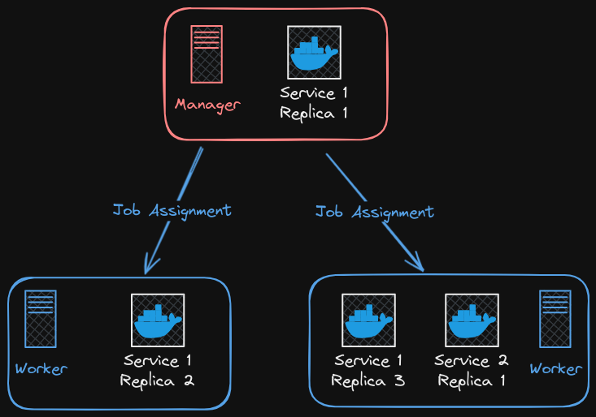

# 5-1: Swarm Setup

Still got both VMs running? Still got the worker's IP address in the NAT Network? Great. We're going to need to access the "Worker" VM shortly. 

First, let's talk about what's about to happen, and why.

We've already seen that compose files are great at creating applications of multiple containers. But let's ask the most annoying question in tech:

***"Does it scale?"***

How will our little WordPress app respond when it's being hammered by thousands of visitors an hour? What happens if one of the containers crashes? Can we build the app in such a way that it is more resilient? And what if we want to make that resilience elastic? Can we scale up and down as needed?

All these questions and more have led to the category of tools known as **container orchestration**. They exist to manage the deployment, replication, and scaling of containerized applications. You have probably heard of the most commonly used orchestration system: [Kubernetes](https://kubernetes.io). Kubernetes (often shortened to k8s because DevOps _craves efficiency_) is a profoundly powerful tool. It is also notoriously complex. It's...a lot. Often, it's more than we need for early orchestration. And luckily, there's another, simpler tool closer to hand: [Docker Swarm](https://docs.docker.com/engine/swarm/).

Put simply, Swarm mode allows us to join multiple Docker hosts together to share resources. It also unlocks some new capabilities, like specifying how many **replicas** of a container in a service we want to deploy. Lastly, it unlocks the **Secrets Manager**, which allows us to securely store and use sensitive data in our containers. 

## How Swarm Works

Docker swarms are made of one or more **nodes**: Docker hosts that can communicate with each other via the Docker HTTP API. In every swarm, there is at least one manager node, and zero or more worker nodes. Managers are where services and **stacks** (more on those later) are deployed and controlled from. They are also the nodes that maintain the state of the cluster and schedule container jobs in the node. 

Do we need a diagram? Here's a diagram.



The Manager can run containers, but also handles job assignments for worker nodes. Here we have 2 services: one with 3 replica containers, and one with just a single replica. The load is balanced across the nodes, unless otherwise specified. All of the service containers are linked via an overlay network that spans nodes and allows communication between container (unless specifically disabled).

One other cool thing the manager does: ingress load balancing! For any service that exposes a port, that port will be exposed by the manager, and ingress to replicas will be rotated amongst the replicas. That port can also be exposed to upstream load balancers.

## Creating the Swarm

Let's activate Swarm Mode! On our original manager VM, run:

```bash
docker swarm init --advertise-addr 10.0.2.x 
```

Replace the IP address with the internal IP of your own manager node.

You'll be given a `Swarm initialized` message, and a very long command to join other nodes to the swarm. A couple things to note: that token is retrievable at any time with `docker swarm join-token worker`. There's also a `manager` option for joining new manager nodes. We won't be doing that for this course. Also, observe the port at the end of the command. That's the default API port that all nodes _must_ be able to communicate over. Be aware of this if you deploy a swarm in an environment with more strict access rules, or between network zones.

Copy that very long command. Still have that worker IP? Let's one-line it with SSH.

```bash
ssh user@worker.ip docker swarm join --token <your-join-token> manager.ip:2377
```

We're taking that whole join command and putting it after the SSH connection syntax. In case you're unfamiliar, you can pass SSH specific commands to run instead of the default shell. So here we'll just pass the join command without having to open and exit a remote session. Success looks like:

```
This node joined a swarm as a worker.
```

And that's it! We're in Swarm mode. In our next chapter, we'll start exploring our newly-unlocked command line powers.

## Check For Understanding

1. **Explain why Swarm might be beneficial for deploying an application. What use cases _don't_ make sense for Swarm?**

2. **Use the `docker swarm` command to make the worker node leave the Swarm, then re-join it.**
