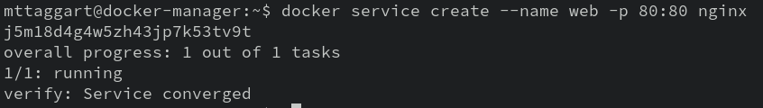
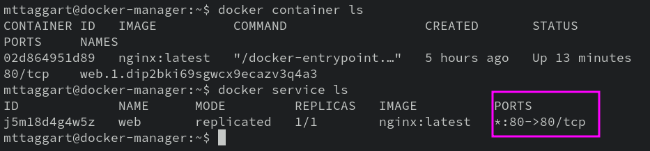
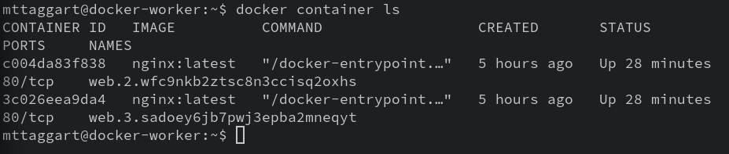

# 5-2: Swarm CLI

Swarm mode comes with some new CLI commands to create and interact with these new, multi-node structures. For this chapter, we'll focus on **services**. Services are sets of containers, one or more replicas, all running from the same image.

Replicas can be distributed amongst swarm nodes, so no one node has to do all the work of running a service. The manager, which is where we create the service, will handle the scheduling of containers on nodes based on availability.

Let's make one with the CLI and see how it works.

## Services

Just like before, we'll start with trusty ol' Nginx.

Unless otherwise specified, every command from here on out happens on the manager node.

```bash
docker service create --name web -p 80:80 nginx
```



We'll get back messages that tell us that 1/1 containers are running and that the service is "converged," meaning all required updates have been made. Now of course if we `curl localhost`, we'll see the default Nginx page. 

`docker container ls` will show us one container running, but pay close attention: there's no port forwarding listed! `PORTS` shows `80/tcp`, but no arrow for forwarding.

That's because the forwarding is not for the container, but for the _service_. Let's compare that to `docker service ls`.



See? The service we created has the port forwarded. This is how replication will function.

Before we move on to replication though, let's mess with this container a little bit. Make a new file called `replica.html`, and put something fun in there.

```bash
echo "<h1>I'm the first replica</h1>" > replica.html
docker container cp replica.html <web_container>:/usr/share/nginx/html/index.html
```

Now of course, `curl localhost` shows our modified file.

Time to replicate!

> Stargate SG-1 fans just got a shiver down their spine.

### Update

When we ran `docker service create`, we could have provided the `--replicas` option to specify how many replicas of the container we wanted for the service. No worries though; we can dynamically scale the service with `docker service update`. Simply provide the new options and the service name, and you're off!

```bash
docker service update --replicas 3 web
```

Now our service is converged, let's re-run `docker service ls`. We see `3/3` replicas. Cool!

Run `curl localhost` a few times. Do you get the same result every time?


If this is your first contact with load balanced, replicated services, this might be kinda freaky. What's happening here?

The service load balancer is routing you to different containers based on availability and, frankly, whose turn it is.

Let's run `docker container ls` again. If you only see one container, guess where the others are?

SSH into the worker node from the manager node. Run `docker container ls` there.



Ah, there they are! The manager assigned the other 2 containers to the worker node. The reason we don't see them cleanly with `docker service ls` is that _it shouldn't matter which container is where_ for most cases. But because we manually modified one of them, there's a discrepancy in some of the requests to the service.

This is, as you might imagine, not the best way to deploy replicas. There's a much easier way to dynamically add material to our replicas, which we'll cover in the next chapter.

### Rollback

But for now, let's get rid of those extra containers. We can revert our service to its _last good configuration_ with `docker service rollback`. Be aware tough, that this command works sort of like the "Back" button on your remote. Once you run `rollback` once, running it again will effectively revert to the change you _just_ rolled back from! Put another way, it can only go back one change.

Let's do it though. Make sure to get back to your manager node!

```bash
docker service rollback web
```

`docker service ls` will confirm we're back to one replica.

And to completely blow this thing away:

```bash
docker service rm web
```

It's worth looking at all the options available in `docker service create --help`, just to get a sense of what kinds of customizations are possible. But manually creating a gigantic one-liner isn't very DevOps (unless you're a k8s admin!). Instead, let's use a little YAML to declare our services in what we call a Stack.

