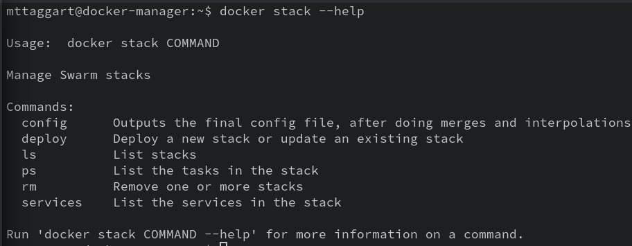
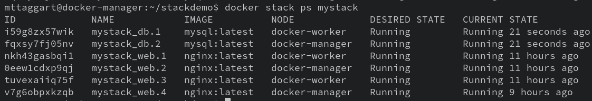

# 5-3: Stacks

We've seen that when we add replication to containers, they become known as "services." Similarly, when we add Swarm mode to compose files, we refer to them as **stacks**.

What's the difference? In Swarm mode, and deployed with `docker stack deploy`, our compose file apps gain replication powers, as well as dynamic updates! This is, in my opinion, Docker at its absolute best. It's how I deploy my own apps, and I really enjoy the workflow.

Let's start with a quick orientation to the `docker stack` subcommand. Run `docker stack --help` to see what's available.



Actually a short list, right? The `config` subcommand works almost identically to the one from `docker compose` to confirm our file syntax and show the intended changes for the deployment.

`deploy`, y'know...deploys. It uses a compose file to do most of its work. so that's where we'll focus next.

## A Stack Compose File

Let's start simple, by composifying (that's a word, promise) our replicated Nginx app. 

Make a new directory on the manager called `stackdemo`, inside of which, make a new `docker-compose.yml`.

Here's what goes in it:

```yaml
version: "3.8"
services:
  web:
    image: nginx:latest
    deploy:
      replicas: 3
    ports:
      - 80:80
```

This should all look pretty familiar, right? The only new component is the `deploy` key, which is where we put all the [stack-specific configuration](https://docs.docker.com/compose/compose-file/compose-file-v3/#deploy). 

`docker stack config -c docker-compose.yml` confirms our file looks good. 

And then, `docker stack deploy -c docker-compose.yml mystack` fires it off! Note that in the case of stacks, the app name is provided explicitly.

## The Stack CLI

Now that our stack is up, we can observe it with some CLI tools. `docker stack services mystack` will show us the service state for all services associated with our stack. And yes, there can be more than one service per stack! We'll see that shortly.

Going deeper, we can use the `docker stack ps mystack` command to see the individual containers that make up the stack's services, including the node on which they're running. This same information is available via `docker service ps <service_name>`, but only for one service at a time.

### Updating Stacks

You might have noticed that `docker stack deploy`'s help said it was used to deploy **or update** a stack. This means the compose file defines the desired state of our stack. To make changes, we make changes in the compose file, then re-run `docker stack deploy`. By tying our state to a file that can be checked into source control, we now have a way to cleanly manage our infrastructure

as

code


Now we're _really_ DevOpsing!

Let's modify our compose file.

```yaml
version: "3.8"
services:
  web:
    image: nginx:latest
    deploy:
      replicas: 4
    ports:
      - 80:80
  db:
    image: mysql:latest
    deploy:
      replicas: 2
    environment:
      MYSQL_ROOT_PASSWORD: this_is_my_root_password
    volumes:
      - db_data:/var/lib/mysql

volumes:
  db_data:
```

Again, pretty familiar! We've updated the `web` service to 4 replicas. We've also  added a `db` service with 2 MySQL replicas, and a volume to store the data. 

> If something about this feels off...hang on.

With these changes, let's re-run our deploy command.

```bash
docker stack deploy -c docker-compose.yml mystack
```

You'll get just a little bit of feedback that the `mystack_web` service is updated, and `mystack_db` is created. No mention of the volume, but `docker volume ls` sure shows it. 

And now, when we run `docker stack ps mystack`, we'll see 6 containers: 4 for the `web` service, and 2 for the `db` service.



## About Volumes

For the `db` service, we defined a volume. `docker volume ls` on the manager node will reveal a `mystack_db_data` volume. So let's try an experiment.

First, determine which of the `mystack_db` containers is running on the manager node. With that name or id in hand, run:

```bash
docker container exec -it <container_id> mysql -u root -p
```

Enter the password from our compose file. Once in the `mysql` prompt, we're simply going to create a new database called `mystack`.

```sql
CREATE DATABASE mystack;
SHOW DATABASES;
EXIT;
```

Remember that we're storing our database information in that volume.

Now, SSH over to the worker node. Using the MySQL container that's running on that node, again enter the mysql prompt. Once inside, run:

```sql
SHOW DATABASES;
EXIT;
```

What da—where'd our `mystack` database go?! 

Right, so here's the gotcha with distributed containers that rely on shared data: local volumes will result in _a different volume of the same name on each node_. They aren't writing to the same database file! Replication of containers does not unify storage—at least not when using the default `local` driver.

So how do you make this happen? In the case of MySQL, you can (and should) set up proper replication of the database across your multiple volumes. [This guide](https://www.luu.io/posts/mysql-replication-docker-swarm) can get you started, but that's outside the scope of this course.

For any other replicated containers that _must_ share a single volume, like for instance a website that uses an S3 bucket for static data, you'll be exploring the [REX-Ray](https://rexray.readthedocs.io/en/stable/) plugin, which adds additional drivers and support to Docker to enable connecting to multiple storage types, including [Ceph](https://ceph.io) as well as popular cloud storage options.

> "Does anyone actually use this?"

Honestly these days, I'm not really certain how common third party volume drivers are. They can be handy for certain use cases, but they introduce a ton of complexity. Besides, there are other ways to connect to services like S3 buckets if we need to. Of course, for that we'd need to provide credentials to the container.

If only there were a way to securely send credentials to a container.

Oh wait—Docker Secrets exists! Let's move on to them.

Make sure to `docker stack rm mystack` before kicking anything else off.
