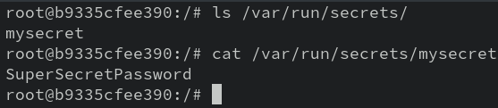

# 5-4: Secrets

## How To Get Secrets Wrong

We've already seen some extremely bad ideas when it comes to secrets management in our containers—plain-text passwords as environment variables are a huge no-no for proper security. That problem becomes a thousand times worse when the secrets are added to source control. When we are deploying infrastructure as code, it is vital that we protect the secrets our deployments use. Unfortunately, it's extremely easy to get this wrong, or to cut corners to get things working. It's much more difficult to do it correctly.

Don't believe me? Have a look at this [GitHub Code Search](https://github.com/search?type=code&q=language%3Ayaml+path%3A*%2Fdocker-compose.yml+MYSQL_ROOT_PASSWORD). Yeah, some of those are examples, but not all of them! That's public code with secrets exposed. 

Our objective is to _not be like these repos_. Secrets need to be kept secret until they are used in the running container; our declarative configuration should not provide them in cleartext.

Docker Secrets is one way we can make this happen. Given that capability, it might seem weird that it's only available in Swarm mode. I kind of agree, but as we'll see, secrets are propagated across the swarm via the Docker API, so there's some reasoning behind that separation.

Okay, enough theory. Let's make some secrets.

## Making Secrets

We know now that we should kick off our exploration of a new subcommand with `--help`, and `docker secrets` is no exception.

```bash
docker secret --help
```

Short list! `create`, `inspect`, `ls`, and `rm`. Let's start at the top.

```bash
docker secret create --help
```

This help line might be a little odd to read. The `create` subcommand takes a name for a secret, and either a file or standard input. I think that's to discourage using cleartext secrets in creation commands—but we're gonna do it anyway.

```bash
echo "SuperSecretPassword" | docker secret create mysecret -
```

You'll get an id back, the universal Docker confirmation that a thing happened. `docker secret ls` will show a new entry!

What it _won't_ show is the secret in cleartext. Nor will `docker secret inspect mysecret`. You'll get some metadata about the secret, but that's it. Once created, Docker will never show your secrets outside of a container. 

## Reading Secrets

So how _do_ secrets get used, anyhow? Turns out, very similarly to volumes. They are mounted inside containers—but not just any containers. As part of Swarm, Docker containers must be part of a service to use secrets. Let's make a quick service right now.

```bash
docker service create --name secretservice -dt --secret mysecret ubuntu
```

> Why no `-i`? How would we interact with it? What if we created a service with multiple replicas of a container; how would we choose which one received our interaction?

Run `docker service ps secretservice` to find where the Ubuntu container ended up, and on that swarm node, use the container's ID to run:

```bash
docker container exec -it <container_id> /bin/bash
```

And once inside the container, take a look at the `/var/run/secrets` directory.



Hi there! And as you can see by `cat`ing the file, it's just a cleartext version of the secret.

And that's...kinda it. If you can read it as a file, you can use it as a secret. 

Feel free to `exit` our container and bring everything down.

```bash
docker service rm secretservice
docker secret rm mysecret
```

And...that's kinda it for secrets. Simple, but elegant. 

One of my favorite use cases for Docker secrets is managing TLS certificates.

I'm not gonna go make you buy a domain name to demo this, but here's the basic idea:

1. A server on the internet that can obtain a [LetsEncrypt](https://letsencrypt.org) certificate
2. A Swarm manager that makes Docker secrets out of the obtained certificate(s)
3. Certificates passed into Nginx containers as secrets

Why is this cool? Because now https://letsencrypt.orgwe've decoupled the image from the certificate, allowing both to be updated independently. And, y'know, not putting private keys in images. It _also_ means that every replica can get the certificate, regardless of what node it's on. 

Secrets are an important component in the secure usage of Docker, but certainly not the whole story. In the next Unit, we're going to cover security best practices for our containerized applications.

