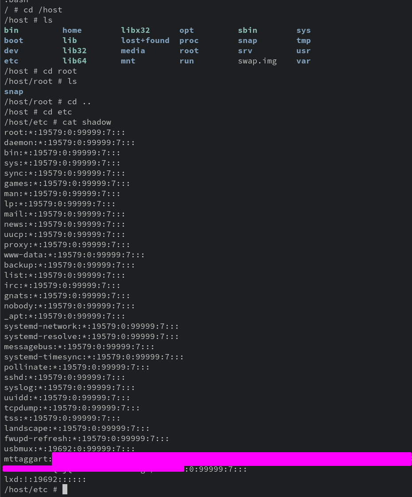
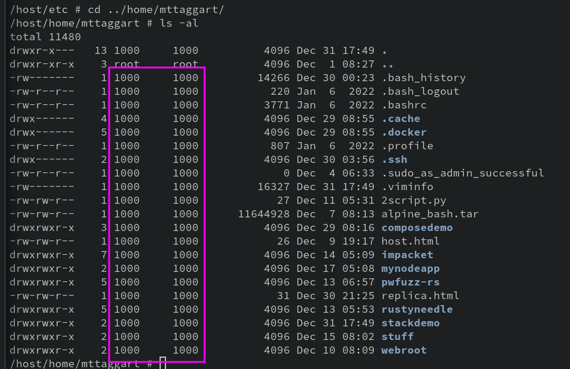
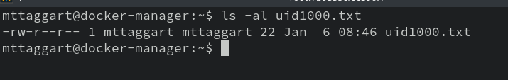
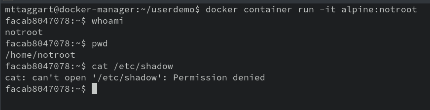

# 6-1: Users

Has it bothered you at all that for every container we've run, we've been `root`? In like _every_ other context on Linux, we're told to limit our usage of the max-privilege user. Why is this suddenly okay in containers?

You might think "Oh well, since containers are a sandbox, there's no risk from running as root." But you'd be wrong. 

Say it with me: ***containers are not a security barrier***.

Once more, with line formatting and emoji:

```
📦 Containers

  ❗ Are Not 

    🛡️ A Security 

      🧱 Barrier 
```

The real reason we've been using `root` in all these containers is, well, it's easier. 

That doesn't make it safe though. We've actually set up our Docker host perfectly to explain why. Give this a try:

```bash
docker container run --rm -it -v /:/host alpine:bash
```

Remember that custom Alpine image we made? Time to put it to use! Okay, what did we just do? We launched a throwaway container with the root of the host filesystem mounted at `/host` in the container. 

Wait...is it possible? Could it be>

***Yes***

We have essentially rooted the host! I can even view `/etc/shadow` on the host from _within the container_.



How is this possible?! Think about how Linux permissions work. They're attached to users based on...username? No, each user has an id number, right? And what is `root`'s  ID number?

I bet it's starting to click. Yeah, on both the host and the container (and everywhere else), `root` is user ID 0. So if we mount a drive with no other instructions, the container will honor permissions on the host. You can confirm this further by looking at the owner of your home folder. Within the container, it'll show an owner/group of something like `1000`. 



See, the container doesn't know who user `1000` is, but it doesn't have to, because the permissions are in fact based on user id! The name is filled in by tools like `ls` later.

Obviously, this is a security nightmare, but it would be pretty weird to have an entire filesystem mounted inside a container. But maybe a directory or two, not so crazy. 

This issue cuts from two directions: inside the container and outside. From within the container, we'd be worried about container escape or unintended access. From outside the container, this capability represents a one-move privilege escalation vector for any attacker that has gotten a user shell on the system.

Well, kinda. Remember that the reason any of our `docker container run` commands work without requiring `sudo` is that we added our user to the `docker` group when we set up the machine. And _this_ is why it's such a terribad idea in production.

## Running as a Different User

Let's see about mitigating this disaster. Docker does give us some options (besides not removing the `sudo` safety). For one, we can run containers as a different user. The `--user` command line option allows us to specify a username or uid (and group/gid if desired). But there's a catch: the container needs to know the user, or things get weird.

Try rerunning our Alpine container (exit out if you haven't already), but this time, with the `--user` option, and your username on the Docker host. Here's mine:

```bash
docker container run --rm -it --user mttaggart -v /:/host alpine:bash
```

You should get an error from Docker that says there's no such user in the image. Which is true! No such user in `/etc/passwd` in the Alpine image. 

But what if we use the user ID?

```bash
docker container run --rm -it --user 1000 -v /:/host alpine:bash
```

Hey now, that works! We don't have a home directory or anything, but the container runs. 

One thing though: run `id`:

```
uid=1000 gid=0(root) groups=0(root)
```

So while we're not `root`, we're still in the `root` group, which is less than ideal. Best to be explicit about that.

Exit out of the container and we'll try one more time.

```bash
docker container run --rm -it --user 1000:1000 -v /:/host alpine:bash
```

`id` should look correct now. So we're user `1000`, whoever that is. If we try now to `cat` `/home/etc/shadow`, we'll see that we've lost the privilege. Progress! But now, how does this fake user 1000 interact with files owned by the _real_ user 1000 on the host? Navigate to your home folder to find out.

```bash
cd /host/home/<username>
```

Running `ls -al` in here confirms that uid 1000 has write permissions to this directory. So can we make a file?

```bash
echo "I'm from a container!" > uid1000.txt
```

Making the file seems to work. Let's exit out of the container and see how it looks on the outside.



Well well well. The file has become the proper user's. 

This is just the beginning of user management in Docker, and frankly a pretty cludgy method. For one thing, we can't guarantee that every system will have a `uid` of 1000. And we also shouldn't be relying on the host's users anyway. Instead we need a way of making a new, non-root user inside the container. For that, we need a Dockerfile.

## Creating Users in Images

The `USER` command in Dockerfile syntax directs the build to run as a given username/uid. But in order to use that, we have to make a user the hard way.

Make a new directory on your Docker host called `userdemo`. Then move inside of it, and create the following Dockerfile:

```docker
FROM alpine:bash
RUN adduser -h /home/notroot -D -s /bin/bash notroot 
WORKDIR /home/notroot
USER notroot
ENTRYPOINT /bin/bash
```

What's up with that `adduser` command? First, it specifies a home directory of `/home/notroot`. Then, we bypass creating a password for this account (no need for one). Then we specify the shell as bash, which we have in this version of Alpine—the one we already made.

We set our working directory to the new user's home folder, and then switch to our new user. When bash launches in this container, it'll be as `notroot` in that home directory.

Build the image with:

```bash
docker image build -t alpine:notroot .
```

And run it.

```
docker container run -it alpine:notroot
```



Looks like things are a lot more secure! Using this method, we can create images to run applications as a specific user, rather than running everything as root. The Splunk images do a great job of this, for example. But we could also imagine a web application running as an application user, mitigating the impact of any remote code execution vulnerabilities in the application.

## Rootless Mode

If you _really_ wanna guarantee that Docker containers run, and can only run, with limited permissions, you can [enable Rootless Mode](https://docs.docker.com/engine/security/rootless/). Because it's sort of destructive, we'll leave this as an exercise for the reader. But the purpose of rootless mode is to guarantee that no elevated host privileges are conferred to containers. The containers themselves may still run as user id 0, but they won't be able to pull off that same host escape/privilege escalation that we did before. 

Rootless mode is a lot, but if you're seeking to maximize the security of your container runtime despite the [significant limitations](https://docs.docker.com/engine/security/rootless/#known-limitations), it's worth at least checking out.

This is a solid start to hardening Docker, but there's much more we can do. Next, we'll explore how to explicitly define _capabilities_ for our containers.

