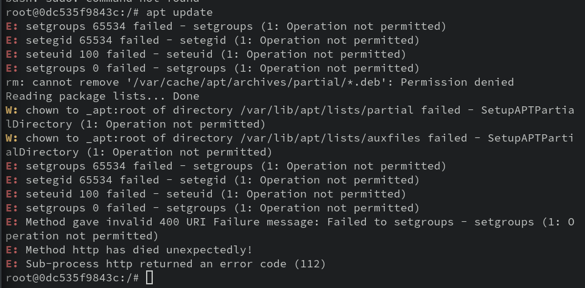

# 6-2: Capabilities

Root and not-root. Pretty binary distinction, wouldn't you say? It seems silly to require access to the highest-privilege user on the system to perform _every_ sensitive operation. A little more granularity would go a long way.

Good news—it exists, and has for some time. Welcome to Linux **capabilities**.

I usually bristle at being sent to the Linux `man` pages, but in this case, `man capabilities` has the best explanation as to what they are and how they work. Open that up and have it handy while we go through this next section.

Linux breaks down the categories of sensitive operations performed by `root` into these permissions sets, or "capabilities." They can be assigned or denied on a per-thread basis. 

"Per thread" means that even in a single process, it could be that one thread has the ability to do something that another thread doesn't. Fortunately, we can also assign capabilities a bit more broadly, such as to binaries. In containerland, we can go a step further and select _just_ the capabilities we want for the entire container.

For Docker, the `--cap-drop` and `--cap-add` options work for both single containers and replicated services. Similar directives exist for [compose files](https://docs.docker.com/compose/compose-file/compose-file-v3/#cap_add-cap_drop). 

## Playing with Capabilities

Let's try some experiments to understand the impact of capabilities. We'll start with a bog-standard `ubuntu` container. But we'll strip it of all capabilities.

```bash
docker container run -it --rm --cap-drop all ubuntu
```

Now suppose I want to install a package here, like Vim.

```bash
apt update
apt install -y vim
```

`record_scratch.wav`



What da—what happened?! By removing all capabilities, we lost the ability to set groups and effective gid/uid, as well as `chown`. That's right: _even as `root`_, we were unable to perform the update!

Ladies and gentlemen, the power of capabilities! Let's exit out and try again with the appropriate capabilities added back in.

**Warning: you are about to understand why almost nobody does this**. 

In order to update the package repos and install Vim, we'll need the following capabilities:

- `CAP_SETUID`: The update process sets the uid manually
- `CAP_SETGID`: Likewise for the gid
- `CAP_DAC_OVERRIDE`: This capability is required to remove files
- `CAP_CHOWN`: To change file owners
- `CAP_FOWNER`: Necessary for `chmod` to make files executable

So to add all those back in, we'll need a `--cap-add` for _each one_. Like so:

```bash
docker container run -it --rm --cap-drop all --cap-add CAP_SETGID --cap-add CAP_SETUID --cap-add CAP_DAC_OVERRIDE --cap-add CAP_CHOWN --cap-add CAP_FOWNER ubuntu
```

Yikes, right? And that's just to make sure `apt update` and `apt install` work!

Capabilities are both powerful and hard to work with. For example, how clear is it that `CAP_DAC_OVERRIDE` is required for removing files? To be honest, I only learned it through trial and error. So unless you know your capabilities cold, and have a comprehensive understanding of what your application needs to do, another approach is to remove the gnarliest capabilities.

Remember that security must always balance with usability. The most "secure" server is one that is off and disconnected from all networks, but that's not much of a server, is it? The reality of application and system architecture involves mitigating risk, not always removing it outright.

So let's say an attacker does gain command execution on our container. What will they want to do with it? Persistence in containers is less intereesting, since they're likely to be short-lived footholds. Instead, the attacker will be looking for data exfiltration opportunities from any app within or connected to the container, or to pivot from the container to the host. In both cases, a little network enumeration is in order. 

But what if we can confound those efforts?

## Removing Capabilities

This time, let's try removing _just one_ capability: `CAP_NET_RAW`. This prevents the use of certain kinds of sockets (but not all). 

For this exercise, we'll use Docker Compose and a Dockerfile. It's the whole shebang! 

Make a new folder called `nocapraw`. Inside, we'll start with a Dockerfile.

```docker
FROM ubuntu:latest
RUN apt update && apt install -y iputils-ping
ENTRYPOINT /bin/bash
```

And the compose file (`docker-compose.yml`):

```yaml
version: "3.8"
services:
  nocapraw:
    image: nocapraw
    build:
      context: .
    cap_drop:
      - NET_RAW
```

In this folder, we can kick off an interactive version of this service with `docker compose run nocapraw`.

> This is the _only_ way to get an interactive version of a Compose file service. It's not supposed to work from `compose up` or `stack deploy`. 

Once the image is finished building, you should see a root shell inside the container.

Alright, we went to all that trouble to install `ping`. Let's ping a thing!

(Sorry, my daughter's starting Dr. Seuss.)

```bash
ping -c 4 google.com
```

Sad trombone. We can't! By removing `CAP_NET_RAW`, we've prevented the `ping` command from opening a raw socket. This might seem like small potatoes, but consider an attacker that _somehow_ gained code execution on the container. and now are looking to pivot from the container to the host. Ping is now unavailable to them! For what it's worth, neither is `nmap`, even if they manage to install it or gain access to it. It's not a perfect defense, but it demonstrates how even a single dropped capability makes he application environment that much more hostile to potential attackers.

## Capabilities in Production

So how do you _really_ use (or not use) capabilities in production? Trial and error, honestly. Start by removing every capability from your running app container, and seeing what fails. Bit by bit, add back in only what's necessary. 

Oh, and pro-tip: this works even better with a non-root user in the container, so you already have the advantage of those restricted permissions. No installing apps, for one.

Capabilities are complex, and therefore often overlooked as a security measure. I encourage you to explore them, if for no other reason than to better understand their implementation on all Linux systems. But when properly deployed, they can be an effective part of a hardening strategy.

The next hardening strategy might not feel very security-oriented, but trust me: the security of your wallet might count on it.

## Check For Understanding

1. **What capability would be required to run `netcat` on port 80?**

