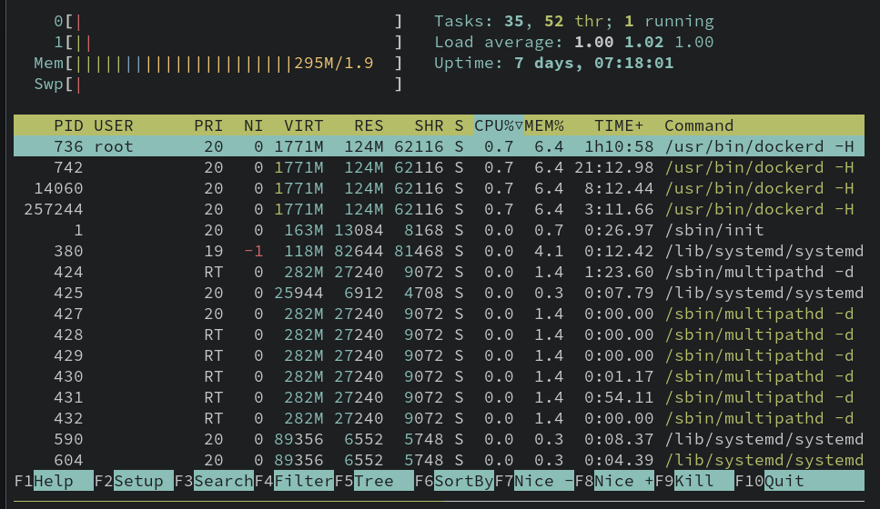
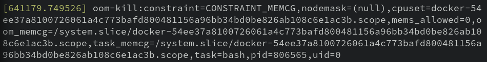
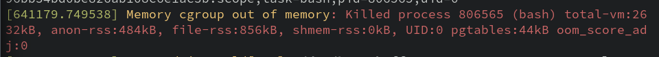

# 6-3: Resources

So you're running a WordPress site using Docker Compose on top of a modestly-provisioned virtual machine. And then: the most predictable compromise on earth happens—a plugin you were using leads to a site takeover! But these criminals aren't interested in ransomware or extortion. Nah, instead they just want your CPU cycles. 

They use their remote code execution to install XMRig and mine cryptocurrency at your expense. And over time, it's no small expense! The compute bill balloons before you notice something's up.

---

Okay obviously in this scenario, you should have some limits on costs in cloud environments, as well as budget alerts. Still, it'd be nice if our infrastructure itself had our back, right?

Docker's got you, fam. In both CLI usage and compose files, we can define maximum and minimum available CPU shares and memory for a given container or replica. 

## The F Bomb

To easily demo this one, we're going to need a little more than a single terminal window. On the host, let's install TMux so we can have multiple terminal windows at once—yes, even on a GUI-less server.

```bash
sudo apt install -y tmux 
```

Run `tmux` to to kick off our terminal multiplexer. Then `Ctrl+B` followed by `"` to split the window horizontally. We can then use `Ctrl+B, up` and `Ctrl+B, down` to switch between panes.

In our top pane, we're gonna kick off `htop` to monitor our system's resource usage.



Note the CPU and memory graphs in the top left. 

Now, in the bottom pane, let's kick off a lightweight container. 

```bash
docker container run --rm --name forky -it alpine:bash /bin/bash
```

And now, in this container, we're gonna do something extremely stupid: intentionally [forkbomb](https://www.cyberciti.biz/faq/understanding-bash-fork-bomb/) ourselves.

> **DO NOT DO THIS** on a system you need to stay up. It should be okay in the VM, but if you're not following instructions and doing this course on your own machine, this will bring it down. Don't.


```bash
:(){ :|:& };:
```

Watch those little bars jump! Yeah we're intentionally maxing the CPU and memory usage of the system to simulate high compute use.

Exit `htop` on the top window (`Ctrl+B, Up` to get back to it) and then stop the container. 

```bash
docker container stop forky
```

Now re-run `htop`. All better! 

What exactly did we accomplish? We proved that at the moment, a Docker container can utilize the entirety of its hosts resources. That can be good or bad, depending on our needs, but if we're concerned at all about compromises leading to use of compute, it is definitely bad news.

## Setting Boundaries

Let's try this again, but this time, with some safeties. We'll cap it to 50% of one CPU, and only 256MB of the 2GB of memory allocated to our host. For `docker container run`, that means using the `--cpus` or `-c` option with a float between 0 and the maximum cores available. And `-m` or `--memory` to specify the maximum memory allocation—in bytes, or using standard notation such as `256M`.

So all together, here's our second attempt at this:

```bash
docker container run --rm --name forky -it --cpus 0.5 -m 256M alpine:bash /bin/bash
```

Run the forkbomb again. What happens?

Before we know it, we're kicked back out of the container. If we're very quick, we'll notice a blip on `htop`. 

What?! Did it work? One way to check is to consult the kernel event buffer with `dmesg`.

```bash
sudo dmesg | grep oom
```

That's just to help filter the noise. We'll see an event like this: 



"OOM" stands for **O**ut **O**f **M**emory. Because we hit our resource constraints, the Linux kernel murdalized the offending process!

If you scroll through the whole `dmesg` output, you'll see an entry like this near the previous one:



A new term has entered the chat! What is a **cgroup**? When we set memory/CPU limits, we in effect created a **Control Group** for the container that allowed the kernel to set the CPU/memory limits. That's not a Docker features; that's a Linux kernel feature that the container runtime takes advantage of.

While it's not awesome that the container died, it's better than unrestricted use of resources.

Go ahead and kill Tmux, unless you like it? `Ctrl+B, d` will detach from the TMux session.

## Resource Constraints in Compose

`docker service create --help` hints at more robust resource control options. `--limit-cpu` and `--limit-memory` are the equivalent to the `-c` and `-m` options we used for `docker container run`. Now while those options cap the resource usage, we also have options to guarantee minimum available resources. The `--reserve-cpu` and `--reserve-memory` options set a "floor" for resources available to the replicas in the service. That's right, remember we're in swarm territory, so the limits and reservations will apply to the node on which the container is deployed.

And of course, there's a compose file version of these commands. They live inside the `deploy` key, like so:

```yaml
services:
  forky:
  # ---
    deploy:
      resources:
        limits:
          cpus: 0.50
          memory: 256M
        reservations:
          cpus: 0.25
          memory: 128M
```

This spec guarantees at least a quarter of one CPU and 128 megabytes will be available for our service.

Our final security chapter is going to depart from configuration and focus on static scanning of our images. That's right: actual vulnerability management!

## Check for Understanding

1. **What is the difference between a CPU limit and a CPU reservation?**

2. **Experiment with how low you can go! What's the minimum amount of memory required to run an `ubuntu` container?**

