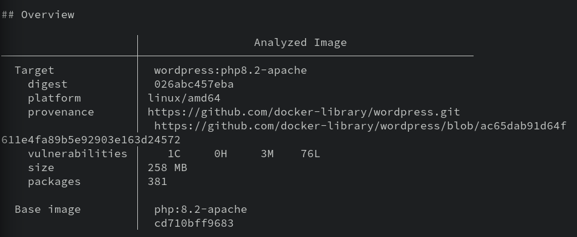
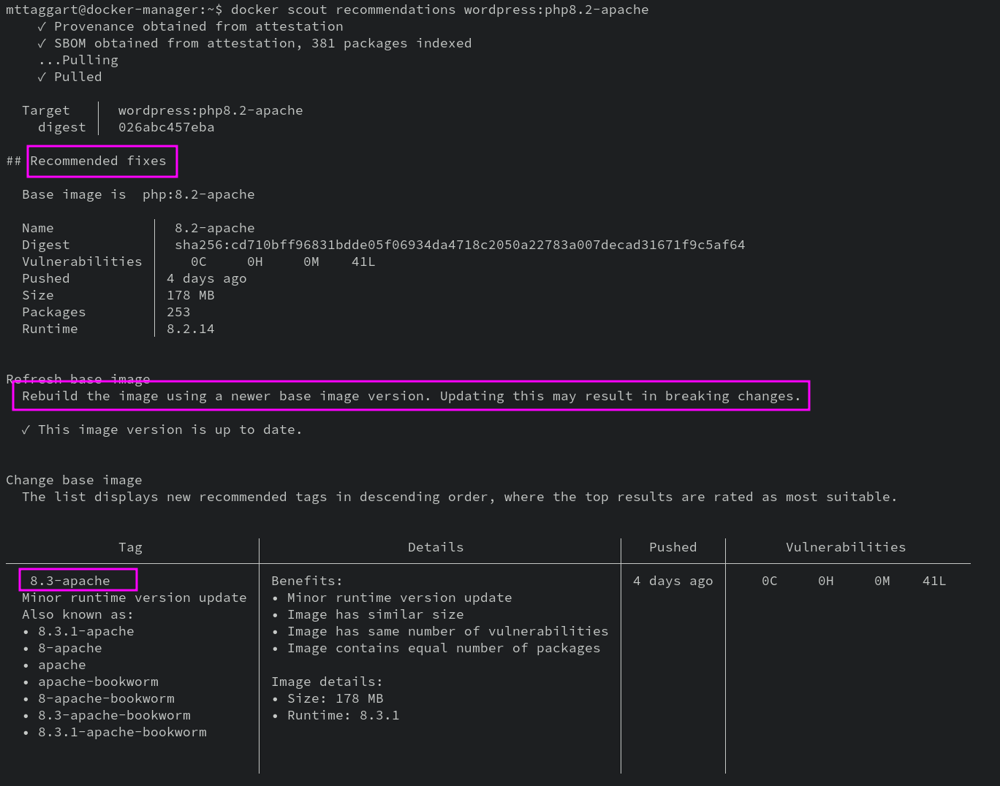

# 6-4: Static Analysis

We're concluding this unit with a brief discussion of vulnerability management, and the concept of "shifting left." If you haven't heard this term before, I envy you. What a great life you've led, full of wise choices. 

If we imagine the software development process as a timeline that begins with developers creating the product and ends with engineers deploying and maintaining it, "shifting left" refers to introducing security considerations earlier in the process—toward developers, where issue can be addressed before they ship.

Leaving aside the fact that we simply need to do _so much better_ when it comes to teaching secure coding practices, one area this approach makes sense is vulnerability management. Very little software exists in a vacuum—dependencies may have vulnerabilities that end up included in our application without us knowing it. That's true for any software project, but it's especially true for containerized apps, where not only do we need to consider direct library dependencies, but any operating system components included in the image.

That's where **static analysis** comes in. By performing, essentially, a vulnerability assessment of our image—including base images as well as our own additions—we are able to catch vulnerabilities before they become risk vectors in production.

In this chapter, we'll explore a couple of options for image scanning, and discuss how these might be integrated into a deployment pipeline.

## Docker Scout

We'll start with the first party tool. [Docker Scout](https://docs.docker.com/scout/) is both a CLI tool and a [dashboard](https://scout.docker.com) available through Docker Hub. The dashboard service offers automated scanning of newly-pushed images, as well as ongoing monitoring. Like Docker Hub itself, Scout's dashboard has a freemium model: only 3 images that you push to your Docker Hub account may be scanned for free.

But the CLI is just free! And since this course is not _actually_ a Docker shill, we're going to focus on the CLi component.

### Installing Docker Scout CLI

Luckily, installing the Scout CLI is a simple enough—just a `curl` to `bash` pipeline. Don't worry; I'm sure there script is safe!

```bash
curl -sSfL https://raw.githubusercontent.com/docker/scout-cli/main/install.sh | sh -s --
```

This will add a subcommand to Docker—you guessed it: `docker scout`! There are a number of sub-sub commands to explore, but we'll start with `cves`. We care about vulnerabilities, after all. This command takes an image and returns a report of all known vulnerabilities in the image by CVE number.

### Running Docker Scout

Let's test this out on one of the images we've used. WordPress might be fun. 

```bash
docker scout cves wordpress:php8.2-apache -o wordpress-vulns.txt
```

We're using the `-o` option to write to a file because the output is going to be rather long, so it's easier to read it with a text editor, or `less`.



Like I said, the report is _long_. But within it, you'll find a list of CVEs that Scout detects in the image and its packages. At the very bottom of the report is a summary of findings. I have:

```
80 vulnerabilities found in 30 packages
  LOW       76
  MEDIUM    3
  HIGH      0
  CRITICAL  1
```

Knowing that, I might search the text for `CRITICAL` to find that Crit. 

That kinda sucks though, right? Luckily, `docker scout` has a `--format` option, which a few potential values. I personally like the [SARIF](https://sarifweb.azurewebsites.net) format, which is JSON. Let's rerun the command to produce SARIF output.

```bash
docker scout cves --format sarif wordpress:php8.2-apache -o wordpress_vulns.json 
```

It's still a giant file. But it's a giant JSON file, which means our old pal `jq` can help us out. I won't make you figure out a useful query from scratch. Here's a starter that provides CVE, the severity, and a text description:

```bash
cat wordpress_vulns.json | jq '.runs[0].tool.driver.rules| .[] | {id, "severity": .properties.tags[0], "text": .help.text}'
```

This is much cleaner, no? And if you really wanted to, you could add `| select(.severity == "CRITICAL")` to get just the Crits.

> If it's seeming at this point like `jq` is a powerful tool with an awful syntax...yeah. It is exactly that.

These CVEs are useful, but neither contextualized, nor paired with remediation steps. Another option, if we're looking for action items, is `docker scout recommendations`. In the case of `wordpress:php8.2-apache`, we'll learn there's a new version of the image! Easy enough to do something about that.



Now that's the first party tool, which as I mentioned is _kiiinda_ designed to loop you into their premium services. And that's okay, honestly! Their premium services are nice, and I've paid for them personally with no complaints.

**But!**

They shouldn't be the only option.

Good news: they aren't.

## Trivy

Scanning container images is one of the many capabilities of [Trivy](https://github.com/aquasecurity/trivy), an incredible scanning tool from Aqua Security. It goes far beyond CVEs and looks for, per their README:

> - OS packages and software dependencies in use (SBOM)
> - Known vulnerabilities (CVEs)
> - IaC issues and misconfigurations
> - Sensitive information and secrets
> - Software licenses

And...it's entirely open source.

## Installing Trivy

Couldn't be easier! They make a `.deb` available on their [releases](https://github.com/aquasecurity/trivy/releases/tag/v0.48.3) page. Make sure you're at the latest release, then find the 64-bit `.deb` file. In your VM, run:

```bash
wget https://github.com/aquasecurity/trivy/releases/download/v0.48.3/trivy_0.48.3_Linux-64bit.deb -O trivy.deb
sudo dpkg -i trivy.deb
trivy --version
```

## Using Trivy

Now that we have this thing installed, what the heck do we do with it? As you might have guessed `trivy --help` will provide us with subcommands, one of which is `image`. 

> If you use any of the other resources scanned by Trivy, **Don't** move on from this chapter without trying those subcommands! It's really quite an impressive bit of kit.

Let's give ti a try on the same image we used Scout on.

```bash
trivy image -o trivy_wordpress.txt wordpress:php8.2-apache
```

As before, we're writing to a file because the default table format is large and messy. Opening it up, we see the summary up top, rather than at the bottom. That's convenient! Here's what I got as of this writing:

```
wordpress:php8.2-apache (debian 12.4)
=====================================
Total: 509 (UNKNOWN: 1, LOW: 332, MEDIUM: 123, HIGH: 50, CRITICAL: 3)
```

Now wait a tick. That's not what Scout found.

```
80 vulnerabilities found in 30 packages
  LOW       76
  MEDIUM    3
  HIGH      0
  CRITICAL  1
```

So Trivy is finding a lot more. This has to do with how it's examining the image—not just the base OS, but software dependencies as well.

Trivy also has `--format``options worth reviewing, including `json` and `--sarif`. The SARIF output matches the structure of Docker Scout's but there are some different tags. A `jq` query to match the Scout query would look like:

```bash
cat trivy_wordpress.json | jq '.runs[0].tool.driver.rules| .[] | {id, "severity": .properties.tags[2], "text": .fullDescription.text} | select (.severity == "CRITICAL")'
```

Notice the `tags[2]` to grab the third tag rather than the first, and the use of `fullDescription` instead of `help`. Some, but not all, of these descriptions, will involve remediation recommendations. Unfortunately, there is no equivalent to `docker scout recommendations` for Trivy. You're on your own there.

Plenty of other commercial or freemium scanning solutions exists, like [Snyk](https://snyk.io/) or [JFrog XRay](https://jfrog.com/xray/). The tool chosen is less important than the process. The idea here is to introduce vulnerability scanning into the containerization pipeline so what known vulnerabilities can be remediated before shipping. It may seem dull, but between preventive scanning and having to handle an exploited vulnerability in your deployed containers, the boring process solution is always the right call.

## Check For Understanding

1. **Explain why it's valuable for developers to own a part of the security assessment process.**

2. **Use `trivy` with `--format sarif` and `jq` to find all Critical vulnerabilities in the latest `nodejs` image.**

