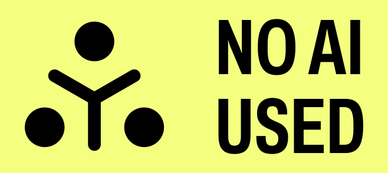

# Container Essentials

This is the text component of the course [Container Essentials](https://taggartinstitute.org/p/container-essentials), hosted on [The Taggart Institute](https://taggartinstitute.org).

## AI-Free Disclaimer

No part of this book was generated by a large language model such as ChatGPT or Google Bard. The prose and code you see here was created by humans, mostly by me, Michael Taggart, with help from open source software authors and contributors.

## Copyright

Although this repository is open source and suggestions in the form of Pull Requests are welcome, this remains the intellectual property of The Taggart Institute, LLC, under the following license:

 This work is licensed under a <a rel="license" href="http://creativecommons.org/licenses/by-nc-nd/4.0/">Creative Commons Attribution-NonCommercial-NoDerivatives 4.0 International License</a>.

## Course Overview

This course serves as a general introduction to the concepts of containerization, and the practical uses of containers to deploy software, use tools, and host services. The course will focus on Docker containers, but also explore the use of alternative container runtimes.

As always, we break down our **learning objectives** between **skills** and **concepts**.

### Skills 

By the end of the course, the learner should be able to:

- Install Docker on a fresh system
- Download images from an image registry
- Run containers
- Build new images from a Dockerfile
- Launch apps with Docker Compose
- Write Compose files to create multi-container applications
- Configure Docker in Swarm Mode
- Apply cgroups, resource constraints, and other security best practices
- Replace Docker with Podman or another container runtime

### Concepts

By the end of the course, the learner should understand:

- The difference between containers and virtual machines
- The relationship between images and containers
- How containers and images are layered
- Why containers should be ephemeral, and how to work with that ephemerality
- How data can persist beyond a single container's lifecycle
- How Docker networking connects and isolates containers
- How Docker Swarm scales containerized applications

## Prerequisites

Although this is an introductory course, **fluency with the Linux command line** is expected. If you need a refresher, we have a [course](https://taggartinstitute.org/p/intro-to-the-linux-command-line) for you!

## Materials/Resources

Learners will have two options for completing the labs: using a local virtual machine provisioned with [VirtualBox](https://virtualbox.org), or using Azure cloud services. While the latter will require an account, the course will be completable with the [Free Trial](https://azure.microsoft.com/en-us/pricing/offers/ms-azr-0044p/) services. This method is offered so that learners who do not have adequate local computing power can still participate in the labs.

We will deploy two Ubuntu virtual machines, each with:

- 2 CPUs
- 2 GB of RAM
- 30 GB of disk space

So if you choose the VirtualBox route, be sure you have adequate compute resources.

## The TTI Community

Discussion and support for this course takes place on [The Taggart Institute Discord](https://discord.gg/taggartinstitute). Please consider joining the community of learners there!

